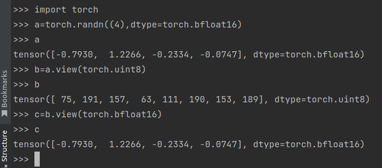

# FSDP 基础认知

# FSDP2 理解\-仅供参考不一定对，需要结合最新源码分析

https://github\.com/pytorch/pytorch/issues/114299

## 全局理解

shards each parameter on dim\-0

- `reshard_after_forward` controls the parameter behavior after forward and can trade off memory and communication\.

    - If `True`, then this reshards parameters after forward and all\-gathers in backward\.

    - If `False`, then this keeps the unsharded parameters in memory after forward and avoids the all\-gather in backward\.

    - If an `int`, then this represents the world size to reshard to after forward\. It should be in `(1, shard world size)`, e\.g\. the intra\-node size\.

    - With respect to [DeepSpeed ZeRO](https://www.deepspeed.ai/tutorials/zero/), `True` is analogous to ZeRO\-3; `False` is analogous to ZeRO\-2; and an `int` is analogous to [ZeRO\+\+](https://www.deepspeed.ai/tutorials/zeropp/) hpZ\.

- `mp_policy` controls various mixed precision options\.

    - `param_dtype` specifies the unsharded parameter dtype, which controls the all\-gather dtype and the dtype for forward/backward computation\.

    - `reduce_dtype` specifies the reduce\-scatter dtype\. If `None`, this inherits from `param_dtype`\. A common example is `param_dtype=torch.bfloat16` and `reduce_dtype=torch.float32`\.

    - `output_dtype` specifies the dtype to cast floating\-point forward outputs\. This is useful for cases where different submodules have different mixed precision policies\.

    - `cast_forward_inputs` specifies whether to cast forward floating\-point input tensors to `param_dtype`\. This is `True` by default to ensure correctness for typical use cases\. However, this can be set to `False` if the user wants to handle cast \(e\.g\. if one input tensor should *not* be cast\)\.


Functionally, applying `fully_shard` to a module:

- Replaces its parameters with `DTensor`s with `(Shard(0),)` placement \(meaning that they are sharded over a 1D mesh on dim\-0\)

- Registers forward hooks to \(1\) all\-gather/free parameters and \(2\) register backward hooks that similarly all\-gather/free parameters and also reduce\-scatter gradients

- Overrides some existing `nn.Module` methods and exposes some new methods on the module


必须要切分，这样才能做到通信和计算重叠。


FQN 名称理解： 完全限定名（Fully\-Qualified Names，简称 FQNs）是计算机领域中用于**唯一标识某个实体**的命名方式，核心作用是消除 “同名实体” 的歧义，确保系统能精准定位目标对象，常见于编程、数据库、网络等场景。

- `fully_shard`: frontend API; applied to a module

- `FSDPModule`: lightweight stateless class for overriding existing `nn.Module` methods and adding new methods; used to dynamically construct the subclass \(e\.g\. `FSDPLinear` from `Linear` and `FSDPModule`\)

- `FSDPState`: class for FSDP\-related state corresponding to the module; embedded on the module using `@contract`

- `FSDPParamGroup`: class for one parameter communication group; at most 1 per `FSDPState` \(0 if no managed parameters\)

- `FSDPParam`: class for one parameter in the communication group


一个 nn\.Module 被 FSDP 包装后，会变成带有 `FSDPState` 的 FSDPModule 模块，而每个 `FSDPState` 都会 0 个或者 1 个 `FSDPParamGroup`， 0 表示这个 FSDP 模块没有参数。而每个 `FSDPParamGroup` 会管理这个 nn\.Module 中所有的参数，是一个 list， list 中每个元素都是一个 `FSDPParam`。 `FSDPParamGroup` 中的参数是一起通信的，在同一个通信组内部。

## FSDP Initialization

The initialization generally logic consists of:

1. Validating and normalizing user arguments

2. Determining the managed modules and their parameters/buffers

3. Materializing meta\-device modules if needed

4. Moving states to `device`

5. Sharding parameters

\(1\) to \(4\) live in `fully_shard.py` and `_fsdp_init.py`\. \(5\) goes through `_fsdp_state.py` to `_fsdp_param_group.py` to `_fsdp_param.py`

We compute managed modules with a graph traversal \(e\.g\. DFS\) from the passed\-in module, stopping at and excluding any module with a non\-composable API \(e\.g\. `replicate` for DDP\) or `fully_shard` already applied\.

### 参数验证与规范化 \(Validating \& Normalizing\)

在调用 `fully_shard()` 时，第一步是确保用户传入的参数（如 `mesh`, `reshard_after_forward`, `offload_policy` 等）是合法的。

- **逻辑位置**：主要在 `fully_shard.py` 的入口函数中。

- **关键动作**：如果用户没有传入 `device_mesh`，FSDP2 会尝试获取当前的默认 Mesh；同时会检查该模块是否已经被分片，避免重复包装。

### 确定受管模块与参数 \(Determining Managed Modules\)

这是 FSDP2 的核心逻辑之一。它决定了哪些参数归属于当前的 FSDP 单元。

- **DFS 遍历**：从当前 `module` 开始向下递归。

- **停止条件**：

    - 碰到另一个 `fully_shard` 包装的子模块（说明该子模块及其下属参数由它自己管理）。

    - 碰到 `replicate` \(DDP\) 包装的模块。

- **结果**：收集所有“属于本层”的 `nn.Parameter` 和 `buffer`。


第一个停止条件比较好理解。第二个停止条件也是重点。

`replicate` 是 FSDP2 架构中与 `fully_shard` 并列的一种并行模式，它对应的就是我们熟悉的 **DDP \(Distributed Data Parallel\)**。

以下是为什么要“特殊处理”并停止遍历的原因：

明确“治理权”：防止冲突

在分布式训练中，一个参数只能被一种策略管理。

- **FSDP \(****`fully_shard`****\)** 的逻辑是：把参数**分片（Shard）**。

- **DDP \(****`replicate`****\)** 的逻辑是：把参数**复制（Replicate）**。

如果你对一个模块应用了 `replicate`（在 FSDP2 中通常通过 `torch.distributed._composable.replicate`），这个模块的参数就已经处于 DDP 的控制下了。如果 FSDP 的 DFS 遍历不停止，它会试图把这些参数也拿去分片，这会导致逻辑冲突和运行时崩溃。


也就是说在 fsdp 范式训练模式下，任何模块要么被 fsdp 包装，要么被 ddp 包装，如果一个模块不是被两个包装，那么是游离状态，这个模块的梯度同步会有问题。假设你有一个复杂的模型，你希望一部分层用 FSDP，另一部分（比如很小的层）用 DDP，此时就可以用这种模式了。

`replicate` 的实现逻辑和 fsdp 几乎一致，非常好。

```Plain Text
from torch.distributed._composable import replicate # 用 ddp 实现
from torch.distributed._composable.replicate_with_fsdp import replicate # 用 fsdp 实现
```

Torch 源码里面有两种方式实现了 replicate。用导包方式来看，目前推荐第一种，不过后面肯定会采用 fsdp 实现。


要实现 `replicate` 上述是一种非常简单的方式，也可以自己对这个模块参数套 DTensor，placement 采用 replicate 也可以实现类似效果，但是没有这个方便。

### 元设备模块实例化 \(Materializing Meta\-device Modules\)

为了支持超大规模模型加载（避免 CPU 内存溢出），用户通常在 `meta` 设备上创建模型。

- **逻辑位置**：`_fsdp_init.py`。

- **关键动作**：检查参数是否在 `meta` 设备上。如果是，FSDP2 会调用用户定义的 `param_init_fn` 或使用默认的 `to_empty` 进行初始化，将“虚”的参数变成“实”的物理内存，参数是切片的。

### 移动状态至设备 \(Moving States to Device\)

在分片之前，必须确保所有参数都在正确的 GPU 设备上。

- **逻辑位置**：`_fsdp_init.py`。

- **关键动作**：将第 2 步中确定的所有 `managed_parameters` 移动到 `device_mesh` 指定的设备上，为后续的分布式张量转换做准备。

### 参数分片 \(Sharding Parameters\)

这是最复杂的一步，FSDP2 通过 `DTensor`（Distributed Tensor）来实现。

- **流转路径**：`_fsdp_state` → `_fsdp_param_group` → `_fsdp_param`。

- **核心逻辑**：

    1. **`_fsdp_state`**: 维护整个 FSDP 实例的状态机。

    2. **`_fsdp_param_group`**: 将属于该模块的参数打包成组。FSDP2 的通信（All\-Gather/Reduce\-Scatter）是以组为单位触发的。

    3. **`_fsdp_param`**: 这里执行真正的 **Sharding**。它将原本的 `nn.Parameter` 包装成 `FSDPParam` 对象，并将其内容转换为 `DTensor`。

    4. **存储变换**：原始的完整形状参数被替换为分片后的本地分片（Local Shard），并根据 `DeviceMesh` 决定在哪些 Rank 上保留哪些数据。

    

被 FSDP 包装了，一个 meta 初始化的 module 就会自动变成 cuda 上，并且已经切分好了。 FSDP 初始化中的峰值显存是多少？ 峰值显存是不是就是 模型参数\*4/fsdp 尺寸？ 


实测，某个模块被 fsdp 包装了，默认情况下不做任何处理，如果本身是 meta 那么 fsdp 切分后也只是 meta 切分了，如果本身是 cpu 才可能会有额外操作。如果是 meta 设备，那么切分后需要自己调用 to\_empty\(\) 操作才行。此时的峰值显存就是 模型参数 \*4 / fsdp\_size。所以上面描述的逻辑不一定全部正确。


## FSDP Runtime

The runtime goals are:

1. All\-gather parameters before they are used and free them after they are used \(in both forward/backward\)

2. Reduce\-scatter gradients after they are computed \(in backward\)

In forward, we define the parameters' *live* interval by `nn.Module.forward()`\. In backward, we define the live interval starting from when the gradients wrt\. the module outputs have been computed to when the gradients wrt\. the module inputs and wrt\. the parameters have been computed\. These definitions map to points in the execution accessible by `nn.Module` and autograd hooks\.

The forward definition can be unsound when parameters are used outside their owning module's `forward()`\. For example, this can happen when users define a custom method that runs forward logic like `generate()` or when a parent module uses a child module's parameter without calling `forward()`\. We discuss handling these cases later\.

这段描述揭示了 **FSDP2 \(Fully Sharded Data Parallel\)** 在运行时（Runtime）的核心调度逻辑。简单来说，它解释了 FSDP 如何通过“生命周期管理”来决定**什么时候把模型参数搬运到显存里（All\-gather），以及什么时候把它们从显存里删掉（Free）**。

以下是针对这段话的详细拆解和核心逻辑解释：

---

### 核心运行机制：动态“借还”参数

FSDP2 的基本思想是不在每张显卡上保存完整模型，而是只存一部分（Shard）。只有在需要计算时，才临时凑齐。

- **All\-gather（凑齐）：** 在计算开始前，从其他显卡把缺失的参数碎片拉取过来，还原成完整的参数。

- **Free / Reduce\-scatter（清理）：** 

    - **Forward：** 计算完立即释放显存，只留分片。

    - **Backward：** 算出梯度后，通过 Reduce\-scatter 将梯度分片回传，并释放掉刚才解压出来的完整参数。

### 定义“生命周期” \(Live Interval\)

为了让上述操作自动化，FSDP2 需要准确知道参数什么时候“开始被用”和“彻底用完”。

- **正向传播 \(Forward\)：** FSDP2 默认认为 `nn.Module.forward()` 开始时是起点，forward 函数结束时是终点。

- **反向传播 \(Backward\)：** 逻辑稍复杂。它从“拿到输出的梯度”开始，到“算完输入的梯度和参数的梯度”结束。也就是说要这个被 fsdp 包装的模块里面的所有梯度都算完才会释放完整参数和梯度。内部逻辑应该是先算每个 dp 的完整梯度，然后执行 reduce\-scatter，然后切片参数和梯度。

- **触发点：** 这些操作是通过挂载在 PyTorch 上的 **Hooks（钩子）** 自动执行的。


FSDP2 默认参数只在 `forward()` 函数内部被调用。但实际代码中，用户经常会绕过 `forward()`：

- **自定义方法 \(****`generate()`**** 等\)：** 在 LLM 推理中，用户常调用 `model.generate()`。如果这个方法直接读取了某些 `layer.weight` 而没有触发 `layer.forward()`，FSDP 钩子就不会被触发，程序会因为找不到完整的参数而崩溃（非法内存访问）。

- **越权访问：** 父模块直接调用了子模块的参数进行计算（例如：`out = self.sub_module.weight * x`），而不是调用 `self.sub_module(x)`。这时，子模块的 `forward` 钩子没跑，参数还是分片状态，计算就会出错。

## `FSDPParamGroup` \& `FSDPState`

Each `fully_shard` call embeds an `FSDPState` object on the module\. This `FSDPState` can have one `FSDPParamGroup` if it manages nonzero parameters\. Then, this `FSDPParamGroup` manages a group of parameters, represented as `FSDPParam`s\.

Comparing `FSDPState` and `FSDPParamGroup`:

- `FSDPParamGroup` is responsible for logic that only happens if there are managed parameters\.

- `FSDPState` is responsible for logic that happens regardless of if there are managed parameters\.

Each `FSDPParamGroup` defines two base operations around parameters:

- Unshard: allocates and all\-gathers parameters

- Reshard: frees all\-gathered parameters


在 FSDP2 的架构中，`FSDPState` 和 `FSDPParamGroup` 是核心的组织单元。如果把 FSDP 比作一个仓储物流系统，`FSDPState` 就是“调度中心”，而 `FSDPParamGroup` 则是“装卸车队”。

以下是对这两个组件及其关系的深度解析：

### 核心架构关系

在 PyTorch 中，当你对一个 `nn.Module` 调用 `fully_shard` 时，会发生以下嵌套关系：

- **`FSDPState`**** \(调度中心\)**：每个被包装的模块都会绑定一个 `FSDPState` 实例。它代表了一个“切片范围”。

- **`FSDPParamGroup`**** \(执行小组\)**：如果这个模块里有需要分片的参数（比如 `weight`, `bias`），`FSDPState` 就会持有一个 `FSDPParamGroup`。

- **`FSDPParam`**** \(基本单位\)**：每个具体的 PyTorch 参数（Tensor）会被进一步封装成 `FSDPParam`。


`FSDPParamGroup` 定义了参数在显存中的“呼吸”过程，这是节省显存的核心。

**Unshard \(展开\)**

- **动作**：分配一块大的临时显存（Buffer），通过 **All\-gather** 通信从其他显卡收集参数分片，拼成完整的参数。

- **时机**：在 `forward` 开始前或 `backward` 梯度计算前。

- **结果**：参数由“瘦身版”变为“完整版”，可以参与正常的矩阵乘法。

**Reshard \(收缩\)**

- **动作**：释放掉 `Unshard` 阶段分配的大块临时显存，只保留该显卡自己负责的那一小块参数分片。

- **时机**：在 `forward` 结束后或 `backward` 梯度同步完成后。

- **结果**：显存占用瞬间下降，为后续层腾出空间。

## FSDP Runtime Schedule

The runtime schedule looks roughly like:

- Root pre\-forward \(`register_forward_pre_hook()` in `_fsdp_state.py`\): lazy initialization if needed; stream synchronization; move inputs to GPU if needed

- For each state/parameter group:

    - State pre\-forward \(`register_forward_pre_hook()` in `_fsdp_state.py`\): cast forward inputs if needed

    - Parameter group pre\-forward \(in `_fsdp_param_group.py`\): unshard parameters

    - Parameter group post\-forward \(in `_fsdp_param_group.py`\): reshard parameters

    - State post\-forward \(`register_forward_hook()` in `_fsdp_state.py`\): cast forward outputs if needed

- Root post\-forward \(`register_forward_hook()` in `_fsdp_state.py`\)

- Root pre\-backward \(`register_hook()` on module output tensors in `_fsdp_state.py`\): queue callback

- For each parameter group:

    - Pre\-backward \(`register_hook()` on module output tensors in `_fsdp_param_group.py`\): unshard parameters; prefetch parameters if needed

    - Post\-backward \(`autograd.Function.backward` in `_fsdp_param_group.py`\): reshard parameters; reduce\-scatter gradients

- Root post\-backward final callback \(`_execution_engine.queue_callback()` in `_fsdp_state.py`\): finalize parameter group backwards; stream/event synchronization; reset data structures


### Forward 阶段：分层级的“生命周期管理”

在正向传播中，FSDP2 遵循从 **Root（根模块）** 到 **Sub\-module（子模块）** 的嵌套执行逻辑。

#### A\. Root Pre\-forward（根启动前）

这是整个模型计算的起点。

- **懒加载初始化**：只有在第一次运行时才进行分片等初始化，节省启动时间。

- **流同步（Stream Sync）**：确保之前的计算流和通信流已经对齐，防止数据竞争。

- **数据搬运**：将输入数据（Tensor）移动到正确的设备（GPU）。

#### B\. 模块执行序列（每个 ParamGroup 循环）

当程序执行到某个具体的子模块时：

1. **State Pre\-forward \(****`register_forward_pre_hook()`**** in ****`_fsdp_state.py`****\)**：处理输入。例如进行 **Mixed Precision（混合精度）** 转换，将 FP32 的输入转为 BF16。

2. **Param Group Pre\-forward \(Unshard in ****`_fsdp_param_group.py`****\)**：核心动作。执行 **All\-Gather**，把当前层需要的参数拼齐。

3. **计算**：执行真正的矩阵运算（如 `Linear` 层）。

4. **Param Group Post\-forward \(Reshard in ****`_fsdp_param_group.py`****\)**：计算一完立即 **Free** 掉拼好的参数，恢复为分片状态，释放显存。

5. **State Post\-forward（****`register_forward_hook()`**** in ****`_fsdp_state.py`****）**：处理输出。将输出结果 cast 回预期精度。

#### C\. Root Post\-forward（根结束 `register_forward_hook()` in `_fsdp_state.py`）

清理正向传播的状态，准备进入反向传播。

### Backward 阶段：基于 Hook 的动态触发

反向传播的执行顺序与正向相反，但由于 PyTorch 的 Autograd 是动态图，FSDP2 使用了复杂的 **Hooks 机制**。

在上一步的 post\-forward hook 中最后会给每个参数注册 pre\-backward hook。确保在 loss\.backward\(\) 后\.


#### Root pre\-backward \(`register_hook()` on module output tensors in `_fsdp_state.py`\)

For each parameter group:

- Pre\-backward \(`register_hook()` on module output tensors in `_fsdp_param_group.py`\): unshard parameters; prefetch parameters if needed

- Post\-backward \(`autograd.Function.backward` in `_fsdp_param_group.py`\): reshard parameters; reduce\-scatter gradients

Root post\-backward final callback \(`_execution_engine.queue_callback()` in `_fsdp_state.py`\): finalize parameter group backwards; stream/event synchronization; reset data structures


在实际应用中，参数组所属模块的嵌套关系可能导致（前向预处理、前向后处理）以及（反向预处理、反向后处理）的生命周期区间发生嵌套。必须采取某些措施，以确保每个“反向预处理钩子”（pre\-backward hook）在每个“反向区间”内仅运行一次；当一个模块在单次前向传播中被多次调用时，可能会存在多个这样的区间。


上述这句话很有信息量，核心还是在于某个模块是共享权重，或者说 forward 两次，fsdp 内部是如何优化的？或者说两个相同模块 forward 中间插入了一个很小的模块会如何？这些需要通过 profile 来深入分析才能了解透彻。


首先可以明确，如果一个模块连续 forward 两次，应该也只有一个 all\-gather，因为有 prefetch 逻辑。backward 肯定也有相应的优化逻辑。


为了确保“每个区间只运行一次”，FSDP2 内部使用了类似**引用计数**或**状态锁**的机制：

1. **区间标记：** 每个 `FSDPParamGroup` 维护一个状态机（如 `Unsharded`, `Sharded`, `In-Progress`）。

2. **一次性触发：** 当反向传播的梯度流（Gradient Flow）到达模块输出时，触发 `pre-backward`。它会检查状态，如果是第一次进入，则执行 All\-gather，并将状态标为 `Unsharded`。

3. **防止重入：** 如果在这次反向计算还没结束时，又有梯度流传到了该模块（共享权重的情况），系统会发现状态已经是 `Unsharded`，从而跳过重复的通信。

4. **精确闭环：** 只有当该区间对应的所有梯度计算彻底完成（触发 `post-backward`），参数才会被 Reshard。


For the post\-backward hook, the custom autograd function forward is an identity function on the input tensors that require gradients, and the backward is an identity function that additionally calls the post\-backward hook\.

为了实现 fsdp 组中管理的所有参数梯度都计算完成后，立即切片参数和梯度功能，torch 会额外注册一个恒等变换算子来确保所有梯度都计算完成后理解释放。但是还是不太理解，到底是注册在哪里？是fsdp参数组上？还是每个参数上？还是 fsdp state 中，不太懂？为啥不用 `register_full_backward_hook`  接口实现？


## `FSDPParam`

As a general framework, each `FSDPParam` considers the following tensors:

- Original parameter:

    - This is the parameter on the module when passed to FSDP\.

- Sharded parameter:

    - This derives by sharding the original parameter on dim\-0 via `DTensor`'s `Shard(0)` placement\.

    - This is always in GPU memory \(unless CPU offloading is enabled\)\.

    - If the original parameter is a `torch.Tensor`, then this is a 1D `DTensor` with `(Shard(0),)` placements\.

    - If the original parameter is a `DTensor`, then this is a 2D `DTensor` with an additional `Shard(0)` placement along the FSDP mesh dim\.

    - This implies that the optimizer step runs through `DTensor`'s operator dispatch, making reducing CPU overhead critical\. This can be achieved mostly via foreach or fused optimizer implementations, which amortize the overheads over tensor lists\.

- All\-gather input:

    - This is the `torch.Tensor` passed to the all\-gather as input\.

    - For the default `torch.Tensor` original parameter case, this has the same data as the sharded parameter\.

- All\-gather output:

    - This is the `torch.Tensor` resulting from all\-gathering the all\-gather input\.

    - For the default `torch.Tensor` original parameter case, this has the same data as the unsharded parameter\.

- Unsharded parameter:

    - This is the parameter used for forward/backward computation derived from the all\-gather output\.

    - This is the leaf for autograd\.


重点是要明白在`FSDPParam`中每个变量的含义和作用。应该不会同时存在

- 原始参数: 应该只是meta信息吧，没有必要维护一份完整参数，那肯定不对

- Sharded parameter： 原始输入参数经过 dtensor 处理后每张卡上切分的参数

- All\-gather input:  执行 all\-gather 的准备输入值

- All\-gather output: 执行 all\-gather 后得到的输出值

- Unsharded parameter： all\-gather 得到的输出值赋予它，才能执行后续计算


因此

- All\-gather input = pre\-all\-gather transform\(sharded parameter\) 收集打包 sharded parameter 参数得到 all\-gather input

- Unsharded parameter = post\-all\-gather transform\(all\-gather output\) 将得到的 all\-gather 输出拆分到参数上变成合并的参数

需要结合源码分析最容易理解。

For example, for a `Float8Linear` weight, the pre\-all\-gather transform can be to cast the fp32 weight to fp8 and return its `torch.Tensor` data\.


When `reshard_after_forward` is an `int`, there is a another tensor for the temporary data constructed from the `unsharded_param` by chunking to the post\-forward world size\. Overall, this means that each `FSDPParam` can be in one of three states: `SHARDED`, `SHARDED_POST_FORWARD`, or `UNSHARDED`\. The only disallowed state transitions are between `SHARDED` and `SHARDED_POST_FORWARD`

## **FSDP \& Autograd**

To implement freeing the unsharded parameter after forward and restoring it before backward, FSDP uses `untyped_storage().resize_(0)` and `resize_(orig_storage_size)`\. This is a *hacky* trick to make autograd work, even in the presence of aliases\. Autograd packs a reference to `unsharded_param` \(or possibly a view of it\) in forward; FSDP frees the storage unbeknownst to autograd on the promise that it will restore it before the gradient computation in backward; and FSDP does so in the pre\-backward hook\.

Replacing this with saved tensor hooks is tricky due to the problem of how to reconstruct a packed tensor from its base tensor\. This is especially tricky when the unsharded parameter is a tensor subclass like `DTensor`\.

### 核心机制：Storage Resize Trick

在 FSDP 中，显存优化的核心在于：**在前向传播（Forward）结束后，立即释放全量参数（Unsharded Param），只保留分片（Sharded Param）；在反向传播（Backward）开始前，重新通信获取全量参数。**

FSDP2 实现这一点的具体流程如下：

1. **Forward 前**：触发 AllGather，分配显存，填充数据。

2. **Forward 中**：模型计算。Autograd 引擎构建计算图。如果算子需要反向求导（如 `matmul`），Autograd 会保存参数的**引用**（或其 View）。

3. **Forward 后（Hack 发生处）**：

    - FSDP 调用 `param.untyped_storage().resize_(0)`。

    - **效果**：底层的 `StorageImpl` 释放了 GPU 显存，数据指针变为空，但 Python层面的 `Tensor` 对象、`TensorImpl`（包含 shape, stride, dtype 等元数据）依然存在。

    - **欺骗 Autograd**：Autograd 拿着这个 Tensor 的引用，以为一切正常（虽然此时如果有人试图访问数据会报错），静静地等待 Backward。

4. **Backward 前（Pre\-backward Hook）**：

    - FSDP 再次触发 AllGather。

    - 调用 `param.untyped_storage().resize_(orig_size)` 并填充数据。

    - **效果**：因为 Autograd 持有的是 Tensor 的引用，而 Tensor 持有的是 Storage 的引用。当我们原地（in\-place）修改 Storage 的大小时，Autograd 手里的那个 Tensor 会自动指向新的（已填充数据的）内存地址。

5. **Backward 中**：Autograd 进行计算，此时数据已经准备好了。


PyTorch 提供了 `saved_tensor_hooks`（`pack`/`unpack`），这本应是处理“为了节省显存而临时卸载/重载 Tensor”的标准方式。然而，在 FSDP 的场景下，特别是涉及到 **Aliases（别名/视图）** 和 **Tensor Subclasses（如 DTensor）** 时，Hooks 方案面临巨大的技术挑战。在 Autograd 的深层机制中，正确地序列化/反序列化（pack/unpack）一个带有复杂元数据的 Tensor Subclass，同时还要保证它和计算图中其他节点的关联（如 View 关系）不被打断，是非常容易出错的。

这段比较高深。

## **FSDP Collectives**

FSDP relies on batched all\-gather and reduce\-scatter for communication efficiency\. \(HSDP additionally relies on all\-reduce, but we omit that for brevity\.\) When using per\-parameter sharding, the options include \(1\) copy\-in/copy\-out and \(2\) NCCL group coalescing\. Our internal benchmarks show that the former is achieves higher bandwidth utilization than the latter \(and aside from the copies, is the same as the existing FSDP collectives, making them more trustable\), so we choose that approach\. \(Adding group coalescing as an option may be future work\.\)


我们先来了解下 NCCL group coalescing。这是 NCCL 提供的原生合并机制。torch 中也有集成：

```Python
*with _coalescing_manager():*
*    for i in range(num_colls):*
*        dist.all_reduce(tensors[i])*
        
*# Asynchronous ops*
*with _coalescing_manager(async_ops=True) as cm:*
*    for i in range(num_colls):*
*        dist.all_reduce(tensors[i])*
*cm.wait()*
```

**机制**：

- 不创建大 Buffer，直接复用参数原本的显存地址。

- 代码逻辑如下：

```Python
dist.group.start()  # ncclGroupStart
for param in params:
    dist.all_gather(param, ...) # 注册任务，不立即执行
dist.group.end()    # ncclGroupEnd -> 触发 NCCL 内部合并
```

- NCCL 驱动会在内部尝试将这些独立的通信请求合并成较少的 Kernel Launch。

**优点**：

- **Zero\-Copy**：不需要额外的 D2D 拷贝，直接通信参数内存。

- **省显存**：不需要分配额外的大 Buffer。

**缺点**：

- **合并能力有限**：如果参数在显存中的物理地址不连续（Fragmentation），NCCL 即使合并了指令，底层传输效率依然受限，无法像处理单一大块内存那样高效。


所以 fsdp 选择了方案 1。


For all\-gather: 切分参数如何 all\-gather 回来

- Allocate a contiguous tensor for the all\-gather output

- Set the all\-gather input as a view into the all\-gather output

- Copy each `sharded_param` into the rank's all\-gather input at the appropriate offset

    - This gives an interleaved layout like `(p1 shard1, p2 shard1, p3 shard1, p1 shard2, p2 shard2, p3 shard2)` for parameters `p1`, `p2`, `p3` and 2 ranks

- All\-gather

- Copy each parameter's shards out to make them contiguous

    - This is currently implemented as viewing to get `(p1 shard1, p1 shard2)`, \.\.\., `(p3 shard1, p3 shard2)` and calling `torch.cat` on the shards in a for loop

Note: For this copy\-in/out approach, the unsharded parameter does not need to be padded, but for NCCL group coalescing it does\.


For reduce\-scatter: 完整参数的梯度如何执行 reduce\-scatter 重新变成切分参数

- Allocate a contiguous tensor for the reduce\-scatter input

- Copy each `unsharded_param.grad` into the reduce\-scatter input

    - This similarly gives an interleaved layout like `(g1 shard1, g2 shard1, g3 shard1, g1 shard2, g2 shard2, g3 shard2)` for parameters `g1`, `g2`, `g3` and 2 ranks

    - This is currently implemented using `torch._foreach_copy_`

- Allocate a separate tensor for reduce\-scatter output

- Reduce\-scatter

- View each new sharded parameter gradient from the reduce\-scatter output and accumulate with `sharded_param.grad` as needed


We find that for loop \+ `torch.cat` achieves better memory bandwidth than `torch.`*`foreach_copy`* for Llama models \(however more extensive microbenchmarking may be valuable\)\. We use *`foreach_copy`* for reduce\-scatter \(1\) for simplicity when handling the possible dtype cast \(e\.g\. when the source is bf16 but destination is fp32\) and \(2\) because autograd does not compute the gradients with padding \(and we do not know how to make it do so\)\. For \(2\), we want to avoid worst\-case doubling the number of tensors to concatenate due to the padding per gradient\.


左边是 fsdp1，右边是 fsdp2，灰色表示 pad 参数。

## **FSDP, Streams, \& Avoiding** **`recordStream`**

- All\-gather copy\-in stream: overlap copy\-in with forward compute and reduce\-scatter

- All\-gather stream: overlap all\-gather with forward/backward computation

- Reduce\-scatter stream: overlap with backward computation; convenient to queue additional work like division

- \(For HSDP\) all\-reduce stream: overlap with all\-gather/reduce\-scatter/backward computation \([details](https://github.com/pytorch/pytorch/pull/106080)\)


When a tensor is allocated in one stream and used in another, PyTorch requires extra synchronization to ensure correctness since streams do not synchronize with each other by default\. One option is to use `recordStream`, which offloads the synchronization burden to the CUDA caching allocator but means that memory is not freed until *GPU* uses finish \(which could be much later than the CPU free\)\. Another option is to manually manage the stream dependencies using explicit synchronization。

### 方案一：`record_stream` \(也就是 "Lazy" 方案\)

这是 PyTorch 提供的一种“把锅甩给 Allocator”的机制。

- **操作**：调用 `tensor.record_stream(stream_B)`。

- **含义**：这相当于告诉 PyTorch 的显存管理器（CUDA Caching Allocator）：“嘿，虽然这个 Tensor 是在 Stream A 创建的，但 Stream B 也要用它。**在你回收这块内存之前，请务必检查 Stream B 有没有用完它。**”

- **缺点 \(核心痛点\)**：

    - **延迟释放 \(Delayed Freeing\)**：
    在 Python 层面，你可能已经删除了这个 Tensor \(`del tensor`\)，CPU 认为这块显存已经可以释放了。
    但是，Allocator 必须等待 **GPU 上的 Stream B 真正执行完相关任务**。

    - **显存碎片/峰值升高**：
    由于 CPU（Python）跑得比 GPU 快得多，Python 已经往前跑了好几层，认为刚才那块显存释放了，于是申请新显存。但 Allocator 说：“不行，Stream B 还在排队用那块旧内存呢，我不能给你复用。” 结果 Allocator 只能去申请**新**的显存块。
    这会导致显存使用量的峰值（Peak Memory）虚高，这对于显存锱铢必较的 FSDP 是不可接受的。

https://dev\-discuss\.pytorch\.org/t/fsdp\-cudacachingallocator\-an\-outsider\-newb\-perspective/1486

Fairscale FSDP, PyTorch FSDP, and DeepSpeed ZeRO use `recordStream`\. Per\-parameter\-sharding FSDP uses manual synchronization instead since doing so can deterministically achieve the desired memory usage \(often saving memory in real workloads\) without any blocking of the CPU thread\.


For all\-gather, we allocate the all\-gather output tensor in the all\-gather stream, but we copy out its contents in the default stream so that the unsharded parameters are allocated in the default stream\. This ensures that autograd will not insert any of its own `recordStream` calls in backward\. For reduce\-scatter, we allocate the reduce\-scatter input and output in the reduce\-scatter stream, so since we view into the output, the sharded gradients are allocated in the reduce\-scatter stream\.


For all\-gather, the synchronization is as follows:

- We record an event after the all\-gather copy\-in for the all\-gather stream to wait on\. 在 all\-gather copy\-in 执行后，给 all\-gather stream 插入一个 event 等待事件

- We record an event after the all\-gather for the default stream to wait on\. 在执行 all\-gather 后，给 default stream 插入一个 event 等待事件

- We record an event after the all\-gather copy\-out for the all\-gather copy\-in/all\-gather streams to wait on\. 在执行 all\-gather copy\-out 后，给 all\-gather copy\-in/all\-gather 插入一个 event 等待事件，防止数据冲突


For reduce\-scatter, the synchronization is as follows:

- We record an event after the reduce\-scatter copy\-in for the default stream to wait on before freeing the autograd\-computed gradients\.

- We do not allocate the reduce\-scatter input in the default stream because then we must have the default stream wait for the reduce\-scatter \(or else after, the reduce\-scatter input will be freed with its memory incorrectly reused in the default stream\)\.

- We do not allocate the reduce\-scatter output in the default stream even though its lifetime should contain the reduce\-scatter itself for simplicity\. I\.e\., this one could go either way\.

- There does not need to be any synchronization between the reduce\-scatter stream and the all\-gather stream since they do not share tensors\. The all\-gather stream operates on the all\-gather output \(and input, which is a view into it\), and the reduce\-scatter stream operates on the reduce\-scatter input \(with gradients copied in\) and the reduce\-scatter output\.


Other synchronization:

- When CPU offloading is enabled, we record an event after the non\-blocking gradient D2H offload for the CPU to block on at the end of backward \(to ensure that the copy finishes\)\.

- We record an event after resharding after forward to a different world size for the all\-gather copy\-in/all\-gather streams to wait on since that data is allocated in the default stream and used in the all\-gather copy\-in stream\.


## **FSDP Checkpointing**

Existing FSDP supports three kinds of state dicts: full, sharded, and local\. We define a "clean" fully\-qualified name \(FQN\) to be one without any `nn.Module` wrapper prefixes \(e\.g\. `_fsdp_wrapped_module.` for FSDP or `module.` for DDP\)\.

- A full state dict maps clean FQN to unsharded `torch.Tensor`\. Since this may use too much GPU memory, it offers `rank0_only: bool` and `offload_to_cpu: bool` options\. This requires all\-gathering parameters\.

- A sharded state dict maps clean FQN to sharded `DTensor`\. For existing FSDP, this requires all\-gathering parameters and resharding to per\-parameter sharding\.

- A local state dict maps clean FQN to the sharded `FlatParameter` as a `ShardedTensor`\. This does not require communication but cannot be loaded into a different distributed training setup\.

For per\-parameter\-sharding FSDP, we only support sharded state dict\.

- Getting a full state dict can be implemented as a post\-processing step to saving the sharded state dict\.

- Sharded and local state dicts are equivalent since the training and checkpointing representation match\.


# FSDP 源码

[FSDP 分析](https://aicarrier.feishu.cn/wiki/EYiNwv21ni0HFekr9zrcHEaenSg)

## 初始化

```python
# 函数调用前会先调用装饰器方法，初始化一个 FSDPState
# FSDPState 非常关键
@contract(state_cls=FSDPState)
def fully_shard(
    module: nn.Module,
    *,
    mesh: Optional[DeviceMesh] = None,
    reshard_after_forward: Union[bool, int] = True,
    mp_policy: MixedPrecisionPolicy = MixedPrecisionPolicy(),
    offload_policy: OffloadPolicy = OffloadPolicy(),
):
    
    elif mesh.ndim == 1:
        # 如果是 1d mesh 则表示纯 fsdp，默认在 0 dim 切分
        mesh_info = FSDPMeshInfo(mesh, shard_mesh_dim=0)
    ....
    
    auto_reshard_after_forward = reshard_after_forward is None
    # If the user does not provide ``reshard_after_forward``, we set it to True.
    # During lazy_init, we identify which module is the root and override its value to False 切分好后，lazy_init 时候会自动发现哪个模块才是真正的 root，这个模块会强行设置 reshard_after_forward=False, 因为根模块比较特殊，这么设置也合理
    
    # 通过这种方式获取到 state，实际上是通过 @contract实现
    state = fully_shard.state(module)
    
    # state 初始化，在这时刻，会给 module 注册 pre_forward 和 post_forward 方法
    # 正是因为上述两个 hook，在 module 调用 forward 时候才会自动触发 fsdp 逻辑，然后一切就流转了
    state.init(module, device, mp_policy) # 重要方法
    
    # 把要忽略的模块去掉，只管理需要训练的模块
    managed_modules = _get_managed_modules(modules, ignored_params)
    # 提取要训练的参数，buffers 只是下面一行会用，fsdp 也是不管的
    params, buffers = _get_managed_states(managed_modules, ignored_params)

    _move_states_to_device(params, buffers, device)
    
    if params:
        # 核心，将参数又绑定到 state 中
        state._fsdp_param_group = FSDPParamGroup(
            params,
            module,
            mesh_info,
            post_forward_mesh_info,
            device,
            mp_policy,
            offload_policy,
        )
    
    # 返回FSDPModule新类，这个类里面可以获取 state，从而可以获取_fsdp_param_group
    # 从而可以获取所有东西
    # 同时在 FSDPModule 里面还额外提供了一些对外接口，方便用户在外面重置 fsdp状态，然后在下一个 hook 运行时候生效
    cls = module.__class__
    dct = {"__deepcopy__": unimplemented_deepcopy}
    new_cls = type(f"FSDP{cls.__name__}", (FSDPModule, cls), dct)
    module.__class__ = new_cls
    return module
```

### state\.init\(module, device, mp\_policy\)

```Python
if len(modules) == 1:
            # 如果这个 fsdp 只包括了 1个 module 则比较简单
            self._pre_forward_hook_handle = modules[0].register_forward_pre_hook(
                self._pre_forward, prepend=True, with_kwargs=True
            )
            self._post_forward_hook_handle = modules[0].register_forward_hook(
                self._post_forward, prepend=False
            )
        else:
        # 如果是一个 seq[module] 则有特殊处理逻辑
            hook_handle = _register_group_forward_hooks(
                modules,
                self._pre_forward,
                self._post_forward,
                self._modules_to_run_forward,
            )
            self._pre_forward_hook_handle = hook_handle
            self._post_forward_hook_handle = hook_handle

# 只给第一个 module 注册 pre-forward hook
# 只给最后一个模块注册 post_forward hook

# 在 PyTorch FSDP 中，一个逻辑上的“层”可能由多个子模块组成。
为了效率，我们不希望每个子模块都触发一次昂贵的通信（如 All-Gather），
而是希望：**在这一组模块中的第一个开始前运行一次预处理，得到seq[module] 参数，在最后一个结束后运行一次后处理**
def _register_group_forward_hooks(
    modules: Sequence[nn.Module],
    pre_hook: Callable,
    post_hook: Callable,
    modules_to_run: set[nn.Module],
):
    """
    Registers group forward pre and post-hooks. The pre-hook runs upon the
    first module pre-forward, and the post-hook runs upon the last. If at least
    one module does not run forward, then the post-hook does not run.
    """
    modules_set = set(modules)

    @disable_if_config_true
    @functools.wraps(pre_hook)
    def wrapped_pre_hook(*args: Any, **kwargs: Any):
        if len(modules_to_run) == 0:  # first to run
            modules_to_run.update(modules_set)
            return pre_hook(*args, **kwargs)

    @disable_if_config_true
    def get_wrapped_post_hook(module: nn.Module):
        @functools.wraps(post_hook)
        def wrapped_post_hook(*args: Any, **kwargs: Any):
            modules_to_run.discard(module)
            if len(modules_to_run) == 0:
                return post_hook(*args, **kwargs)

        return wrapped_post_hook

    pre_handles = [
        module.register_forward_pre_hook(
            wrapped_pre_hook, prepend=True, with_kwargs=True
        )
        for module in modules
    ]
    post_handles = [
        module.register_forward_hook(
            get_wrapped_post_hook(module), prepend=False, always_call=True
        )
        for module in modules
    ]
    return _MultiHandle(tuple(pre_handles + post_handles))
```

### torch\.utils\.swap\_tensors

```Python
def _move_states_to_device(
    params: list[nn.Parameter],
    buffers: list[torch.Tensor],
    device: torch.device,
) -> None:
    """
    We have FSDP move states to device for simpler and faster initialization
    since FSDP almost always uses CUDA for training. We move parameters/buffers
    rather than modules since modules to support ignoring parameters/buffers in
    the future.
    """
    # Follow the logic in `nn.Module._apply`
    for tensor in itertools.chain(params, buffers):
        if tensor.device == device or tensor.device.type == "meta":
            # Keep meta-device tensors on meta device for deferred init
            continue
        if isinstance(tensor, DTensor):
            if (dtensor_mesh_type := tensor.device_mesh.device_type) != device.type:
                raise ValueError(
                    "Requires DTensor to have mesh of the same type as the FSDP mesh "
                    f"but got {dtensor_mesh_type} for DTensor and {device.type} for FSDP"
                )
            raise AssertionError(
                f"Expects DTensor to be moved to {dtensor_mesh_type} but got {tensor.device}"
            )
        tensor_ = tensor
        if is_traceable_wrapper_subclass(tensor_):
            with torch.no_grad():  # avoid autograd increasing C++ refcount by 1
                tensor_on_device = nn.Parameter(tensor.to(device))
            torch.utils.swap_tensors(tensor, tensor_on_device)
        else:
            tensor.data = tensor.to(device)
```

黑魔法。

`torch.utils.swap_tensors` 是 PyTorch 2\.0\+ 引入的一个底层“黑科技”，它的作用远比普通的赋值要强大。简单来说，它能**在不改变对象内存地址（Python ID）的前提下，原地交换两个 Tensor 的所有内部状态**。


在深度学习框架中，一个 Tensor 往往被多处引用。 假设有一个 `Linear` 层的权重 `m.weight`：

- **普通赋值：** `m.weight = new_tensor`

    - 这只是让 `m.weight` 指向了新对象。如果之前有别的变量（比如优化器或某个 Hook）引用了旧的 `m.weight`，它们**依然指向旧对象**，导致更新丢失。

- **`.data`**** 赋值：** `m.weight.data = new_tensor.data`

    - 虽然能改数据，但无法处理 Tensor 的元数据改变（比如形状变化、不同的张量扩展类等），且容易绕过 Autograd 的监控，不安全。

**`swap_tensors`**** 的方案：** 它像“换脸术”一样，直接把两个 Tensor 的内部实现（Storage、Stride、Metadata 等）对调。对外部引用者来说，Tensor 还是那个对象，但里面的灵魂换了

```Python
import torch

# 准备两个 Tensor
a = torch.randn(2, 3)
b = torch.randn(5, 5)

print(f"交换前 a 的 ID: {id(a)}, 形状: {a.shape}")

# 执行交换
torch.utils.swap_tensors(a, b)

print(f"交换后 a 的 ID: {id(a)}, 形状: {a.shape}")
# a 的 Python ID 没变，但它现在拥有了原来 b 的内容和形状 (5, 5)
```

在 FSDP 的初始化或参数转换过程中，经常需要将普通的 `nn.Parameter` 转换为 `FlatParameter` 或者从 CPU 迁移到 GPU。

- **保持引用一致性：** FSDP 往往在模型初始化后才进行参数分片。此时，优化器可能已经持有了模型参数的引用。使用 `swap_tensors` 可以确保优化器手里拿到的那个“对象”自动更新为分片后的、GPU 上的新状态，无需重新初始化优化器。

- **处理 Tensor 子类：** FSDP 大量使用分布式张量（DTensor）或受监控的包装类。这些复杂的子类如果用 `.data` 赋值会丢失元数据信息，而 `swap_tensors` 能完美保留子类的特质。


这是一个**非常底层**的 API。在日常开发中，如果你只是想改数值，建议用 `copy_()`；如果想 to device，可以用  tensor\.data = tensor\.to\(device\)，如果想改变类型，可以  tensor\.data = tensor\.float\(\)。只有当你需要**大规模改变 Tensor 属性（如设备、形状或所属类）且必须保持外部引用不失效时**，才动用 `swap_tensors`。

### FSDPParamGroup 初始化

```Python
state._fsdp_param_group = FSDPParamGroup(
            params,
            modules,
            mesh_info,
            post_forward_mesh_info, # 估计是设计时候任务 post-forward 可能和 pre-forard mesh 不一致把
            device,
            shard_placement_fn,
            mp_policy,
            offload_policy,
        )
```

```Python
def __init__(
        self,
        params: list[nn.Parameter],
        modules: tuple[nn.Module, ...],
        mesh_info: FSDPMeshInfo,
        post_forward_mesh_info: Optional[FSDPMeshInfo],
        device: torch.device,
        shard_placement_fn: Optional[Callable[[nn.Parameter], Optional[Shard]]],
        mp_policy: MixedPrecisionPolicy,
        offload_policy: OffloadPolicy,
    ):
        self.modules = modules  # permit ref cycle because 1:1 lifetime
        # 将输入的 list params 组成 list of ParamModuleInfo
        param_module_infos = _get_param_module_infos(params, modules)
        
        # 核心参数
        self.fsdp_params = [
            FSDPParam(
                param,
                module_info,
                mesh_info,
                post_forward_mesh_info,
                device,
                shard_placement_fn,
                mp_policy,
                offload_policy,
            )
            for param, module_info in zip(params, param_module_infos)
        ]
        self.mesh_info = mesh_info
        self.post_forward_mesh_info = post_forward_mesh_info
        self.device = device
        self.device_handle = _get_device_handle(device.type)
        self.mp_policy = mp_policy
        self.offload_policy = offload_policy
        self._training_state = TrainingState.IDLE
        # Group's sharded state always matches its parameters' sharded states
        self._sharded_state = ShardedState.SHARDED
        self._module_fqn: Optional[str] = None  # prefixed from root module
        # Only consider resetting sharded parameters once in lazy init since it
        # can incur nontrivial overhead to reset them
        self._reset_sharded_params: bool = False

        # - Hook state
        # 它会给“包含 FSDP 参数的那些 modules”注册 pre-save / pre-load hook，在保存/加载 state_dict 前把参数切回 sharded
        self._module_to_pre_save_state_dict_hook_handle: _ModuleToHandleDict = {}
        self._module_to_pre_load_state_dict_hook_handle: _ModuleToHandleDict = {}
        
        self._all_reduce_hook: Optional[Callable[[torch.Tensor], None]] = None
        # Optional stream to run the user-defined all-reduce hook in
        # Saved here and not in the comm. context because we allow the user to
        # specify it, possibly at construction time before lazy init
        self._all_reduce_hook_stream: Optional[torch.cuda.Stream] = None

        # - Communication and communication/computation overlap
        self.comm_ctx = FSDPCommContext()
        # Group's indices in the shared post-forward order
        self._post_forward_indices: list[int] = []
        # Whether to reduce gradients at all (whether for FSDP or HSDP)
        self.reduce_grads: bool = True
        # Whether to all-reduce gradients for HSDP; only used if
        # `self.reduce_grads` is true, in which case setting this to false
        # means reduce-scatter but no all-reduce
        self.all_reduce_grads: bool = True
        # Whether to reshard parameters after backward (only useful for
        # gradient accumulation)
        self.reshard_after_backward: bool = True
        # Optional custom factor for the gradient reduction op (e.g. to divide
        # by a factor other than the world size)
        self.gradient_divide_factor: Optional[float] = None
        # Whether reduce-scatter and all-reduce should be issued using only
        # summations, potentially with separate pre-/post-scaling.
        self.force_sum_reduction_for_comms: bool = False
        # `async_op` arg used for pre-forward/pre-backward unshard; can be
        # overridden to only do explicit prefetching and avoid inter-stream
        # fragmentation from using separate unshard streams
        self.unshard_async_op: bool = False
        # Whether to unshard in backward: can be overridden by the user if the
        # parameters in this group are not needed for backward (e.g. embedding)
        self.unshard_in_backward: bool = True
        # Whether to (try to) use the ProcessGroup's allocate_tensor method for
        # the staging buffers for collective comms.
        self.allocate_memory_from_process_group = False

        # - CUDA events for stream synchronization
        # Holds the all-gather output buffer, sync objects, and metadata
        self._all_gather_result: Optional[AllGatherResult] = None
        # Holds the reduce-scatter/all-reduce view-out CUDA event that marks the end of
        # the group's post-backward (e.g. reduce-scatter, all-reduce and div), which
        # should be waited on at the end of backward
        self._post_reduce_event: Optional[torch.Event] = None
        # Holds the reshard-after-forward CUDA event when resharding to a
        # different world size, which should be waited on in the next unshard
        self._reshard_after_forward_event: Optional[torch.Event] = None

        # Only for HSDP, if accumulating gradients without all-reduce, save the
        # partial reduce output (only reduce-scattered but not all-reduced)
        self._partial_reduce_output: Optional[torch.Tensor] = None
        # Holds the all-reduce input and all-reduce event to keep it alive
        # until the end of backward (critical when doing bf16 reduction with
        # fp32 parameters since the all-reduce input is allocated in the RS
        # stream and will have no refs to it after being upcast to fp32)
        self._all_reduce_state: Optional[AllReduceState] = None
```

```Python
# 会考虑 module 内部实现时候的各种共享写法。
# 共享写法也会单独处理，不会合并到一起。因为后续 fsdp 会频繁切状态，如果不单独处理，可能状态不对
# 例如 mlp.lin1 = mlp.lin2 这种情况，那么是两个 ParamModuleInfo 并记录共享状态
# 当 fsdp setattr 时候也会一并处理，否则可能出现 fsdp 处理后状态不在是 shard 状态 bug
def _get_param_module_infos(
    params: list[nn.Parameter], modules: tuple[nn.Module, ...]
) -> list[ParamModuleInfo]:
    """
    Shared parameter: lin1.weight = lin2.weight
    Shared module: mlp.lin1 = mlp.lin2
    We do not remove duplicates when traversing both modules and parameters to
    find shared modules' parameters and shared parameters within a module.
    """
    params_set = set(params)
    param_to_module_info: dict[nn.Parameter, ParamModuleInfo] = {}
    for module in modules:
        for _, submodule in module.named_modules(remove_duplicate=False):
            **for param_name, param in _named_parameters_with_duplicates(**
**                submodule, recurse=False**
**            ):**
                if param in params_set:
                    if param not in param_to_module_info:
                        param_to_module_info[param] = ParamModuleInfo(
                            submodule, param_name
                        )
                    else:
                        param_to_module_info[param].shared_modules.append(submodule)
                        param_to_module_info[param].shared_param_names.append(
                            param_name
                        )
    if len(param_to_module_info) != len(params):
        raise AssertionError(f"Some parameters are not in the module tree of {module}")
    return [param_to_module_info[param] for param in params]
```

比如这种写法

```Python
import torch
import torch.nn as nn

class MLP(nn.Module):
    def __init__(self):
        super().__init__()
        shared = nn.Linear(4, 8, bias=True)
        self.lin1 = shared       # 别名 1
        self.lin2 = shared       # 别名 2（共享同一个 module 对象）

m = MLP()
```

- named\_modules\(remove\_duplicate=False\)：即使 `lin1`、`lin2` 指向同一个 submodule，也会以两个路径都遍历到它；

总之内部会处理各种 module 里面共享权重或者共享 module 的写法。

### FSDPParam 初始化

这个管理一个参数的具体切分，all\-gather 等的具体操作。也就是说这个才是真实做事的，前面的 group 只是一个全局协调者，然后以组的方式统一进行某种操作。


**FSDPParam**** 是“单个参数”的管理器：负责把原始参数切成 shard（DTensor）、按需 all\-gather 成 unsharded、再 free/unfree 存储，并在模块上做参数 swap。****`FSDPParamGroup`**** 只是把一堆 ****FSDPParam**** 组合起来做 group 通信/overlap。**

```Python
def __init__(
        self,
        param: nn.Parameter,
        module_info: ParamModuleInfo,
        mesh_info: FSDPMeshInfo,
        post_forward_mesh_info: Optional[FSDPMeshInfo],
        device: torch.device,
        shard_placement_fn: Optional[Callable[[nn.Parameter], Optional[Shard]]],
        mp_policy: MixedPrecisionPolicy,
        offload_policy: OffloadPolicy,
    ):  
        # 关键信息
        #（module + param_name + shared_*）是为了后面频繁的 _setattr_on_modules()：在 sharded/unsharded 间切换时能快速把 nn.Parameter 写回 module（并同步所有共享别名位置）。
        self._module_info: ParamModuleInfo = module_info
       
        self.mesh_info = mesh_info
        self.post_forward_mesh_info = post_forward_mesh_info
        self.device = device
        self.mp_policy = mp_policy
        self.offload_to_cpu: bool = isinstance(offload_policy, CPUOffloadPolicy)
        self.pin_memory = (
            self.offload_to_cpu and cast(CPUOffloadPolicy, offload_policy).pin_memory
        )
        self.grad_offload_event: Optional[torch.Event] = None
        
        # 最关键代码
        # **FSDP2 应用后，模块上原本的参数对象会被替换成“sharded 参数”**
        self._init_sharded_param(param, device, shard_placement_fn)
        
        if self.post_forward_mesh_info:
            self._init_sharded_post_forward_param_metadata(param) # 通常是 hsdp 用的
          
        self._init_extensions()
        self.all_gather_outputs: list[torch.Tensor] = []
        self.unsharded_accumulated_grad = None
        self._param_fqn: Optional[str] = None  # prefixed from root module
        
        # TODO: Remove this padding logic once DTensor pads the local tensor:
        # https://github.com/pytorch/pytorch/issues/113045
        # 一旦 fsdp 后触发了 load_state_dict 操作，可能会破坏 fsdp 内部对参数的引用和管理
        # 因此需要在后面重新触发一次 shard param 的更新
        self._post_load_hook_handle = (
            module_info.module.register_load_state_dict_post_hook(
                lambda *args, **kwargs: self.reset_sharded_param()
            )
        )
```

#### \_init\_sharded\_param 重点

先忽略本身是 dtensor 场景，考虑最简单情况。

```Python
@torch.no_grad()
    def _init_sharded_param(
        self,
        param: nn.Parameter,
        device: torch.device,
        shard_placement_fn: Optional[Callable],
    ):
        fsdp_placement = shard_placement_fn(param) if shard_placement_fn else None
        if fsdp_placement is None:
            fsdp_placement = Shard(0) # 默认是对参数的 dim0 进行切分
        elif fsdp_placement.dim < 0:
            fsdp_placement = Shard(fsdp_placement.dim + param.ndim)

        self.fsdp_placement = fsdp_placement
        shard_dim = fsdp_placement.dim
        # TODO: Replace the sharded DTensor parameter construction logic with
        # `distribute_tensor` after https://github.com/pytorch/pytorch/issues/116101
        # TODO: Simplify the following sharded parameter padding logic after
        # https://github.com/pytorch/pytorch/issues/113045
        self.is_dtensor = isinstance(param, DTensor)
        if self.is_dtensor:
           pass
        else:
            self._spmd_mesh = self.mesh_info.mesh
            if isinstance(self.mesh_info, HSDPMeshInfo):
                self._spmd_placements = (Replicate(), fsdp_placement)
            else:
                self._spmd_placements = (fsdp_placement,)
            # 有了这个 spec 就可以对参数直接进行切分
            self._sharding_spec = DTensorSpec(
                self._spmd_mesh, # 正常是 world_size mesh
                self._spmd_placements, # shard(dim=0)
                tensor_meta=TensorMeta(param.size(), param.stride(), param.dtype),
            )
            param_data = param
        assert param_data.is_contiguous(), f"{param_data.shape=} {param_data.stride()=}"
        shard_dim = fsdp_placement.dim
        
        # 原始输入参数，假设是 (4096,2048)
        self._orig_size = param_data.size()
        self._contiguous_orig_stride = make_contiguous_strides_for(self._orig_size)
       
        shard_rank = self.mesh_info.shard_mesh_rank
        shard_world_size = self.mesh_info.shard_mesh_size
        if shard_dim > 0 and param_data.size(shard_dim) % shard_world_size != 0:
            # If sharding on nonzero dim, require even sharding for now because
            # the uneven sharding (1) requires extra copies before/after FSDP
            # collectives and (2) introduces extra complexity to handle padding
            # and unpadding
            # 如果不是第一维度 shard，fsdp pad 逻辑比较难处理，因此强制要求必须可以被整数切割
            # 第一维度 shard， fsdp pad 逻辑比较好处理，移除和新增都比较容易，本身也是 contiguous 行为，所以 fsdp 帮我们做了
            raise NotImplementedError(
                f"FSDP does not support uneven sharding on dim {shard_dim}: "
                f"{param_data.size()} (world size: {shard_world_size})"
            )
        # shard param data
        chunks = _chunk_with_empty(param_data, shard_world_size, dim=shard_dim)
        sharded_param = chunks[shard_rank]
        # 计算切割后 size, 假设一共 7 张卡，rank6 size 是 (580,2048)，其余 rank 都是 (586,2048)
        self.sharded_size = _get_dim_chunked_size(
            sharded_param, param_data.size(), dim=shard_dim
        )
        self.contiguous_sharded_stride = make_contiguous_strides_for(self.sharded_size)
        # 这个一定是完整的 (586,2048)
        padded_sharded_size = chunks[0].size()  # 0th always padded
        self.padded_sharded_param_size = padded_sharded_size
        # 提前准备好 padding 规整的数据，防止 all=-gather 那边不好弄
        # Pre-pad the sharded parameter to avoid padding before all-gather
        padded_sharded_param = param_data.new_zeros(padded_sharded_size)
        if sharded_param.numel() > 0:
            # 把真实数据填充进去，pad 部分默认是全 0
            padded_sharded_param.narrow(
                dim=shard_dim, start=0, length=sharded_param.size(shard_dim)
            ).copy_(sharded_param)
        if self.offload_to_cpu and not padded_sharded_param.is_meta:
            padded_sharded_param = padded_sharded_param.cpu()
            if self.pin_memory:
                padded_sharded_param = padded_sharded_param.pin_memory(
                    device=self.device
                )
        # 这个才是真实数据，当前是 meta 状态
        self._sharded_param_data = padded_sharded_param.view(-1)
        
        # 从 padding过后数据里面利用 narrow 索引出不带 pad 的真实数据，共享存储
        length = sharded_param.size(shard_dim) if sharded_param.numel() > 0 else 0
        sharded_param = padded_sharded_param.narrow(
            dim=shard_dim, start=0, length=length
        )
        assert sharded_param.is_contiguous(), f"{self.fsdp_placement=}"
        # 构成 dtensor，并且带梯度
        # DTensor(local_tensor=tensor(..., device='meta', size=(580, 2048)), device_mesh=DeviceMesh('cuda', [0, 1, 2, 3, 4, 5, 6], mesh_dim_names=('default.fsdp',)), placements=(Shard(dim=0),))
        self.sharded_param = nn.Parameter(self.to_sharded_dtensor(sharded_param))
        self.sharded_param.requires_grad_(param.requires_grad)
        
        # Let `param_data` be freed normally when its ref count reaches 0 when
        # the `fully_shard` call returns to allow provided parameters to alias
        # 替换 module 属性，从 meta tensor 变成 meta dtensor
        self._setattr_on_modules(self.sharded_param)
        self.sharded_state = ShardedState.SHARDED
```

```Python
self._sharded_param_data(1D, 含padding)
    ↓ [底层存储]
    ├─→ 用于内存管理（alloc/free storage）
    ├─→ 用于通信（all-gather input）
    └─→ 支持 CPU offload
    
self.sharded_param(ND, 无padding, narrow view)
    ↓ [逻辑表示]
    ├─→ 注册到 nn.Module
    ├─→ 参与计算和 autograd
    ├─→ 用户可见的参数
    └─→ DTensor 包装
```

有了 self\.\_sharded\_param\_data 为啥还需要 self\.sharded\_param？虽然是同一个内存？

最核心的原因还是：

只有 sharded\_param 需要追踪梯度，padding 部分不需要。这样：

- 梯度只在有效数据上计算

- 节省内存和计算

- 避免 padding 的梯度污染


经过上述操作，就从 meta tensor 变成了 meta dtensor。

#### distribute\_tensor

dtensor\_value = distribute\_tensor\(value, mesh, \[Replicate\(\)\]\)

将一个 local tensor 变成 dtensor。有一个注意事项： 不同 rank 的 value 不仅仅都要在 cuda 上，还必须在不同的 gpu id上。如果都是 cuda:0，则通信会卡住。

#### fsdp\_model\.load\_state\_dict

如何在一个 model 被包装了 fsdp 后加载 hf 权重呢？

有两个办法：

\(1\) local\_tensor\.copy\_\(\)

这个比较合理。因为 fsdp 后参数就切分了，如果要加载，可以获取每个 dtensor 参数的 local\_tensor，然后从 hf 权重里面切分出对应位置，加载就行。xtuner 目前采用的是这个逻辑。


\(2\) load\_state\_dict

依然可以直接调用 fsdp\_model\.load\_state\_dict，但是因为内部的都是 dtensor，因此你传入的 state\_dict 也必须是 dtensor 格式才行，否则内部会报错。一旦你传入的是 dtensor，当执行 tensor\.copy\_\(\) 时候会触发 dtensor 的 copy\_ 逻辑，他会自动基于 rank 切分出对应内容加载。

```Python
converted_state_dict = {}
    # full_state_dict 是 hf cuda tensor
    for key, value in full_state_dict.items():
        if isinstance(value, torch.Tensor):
            print(f"Rank {rank}: 转换 {key} 为 DTensor (device: {value.device})")
            
            assert value.is_cuda, f"Rank {rank}: {key} 不在 CUDA 上！"
            assert value.device.index == rank, f"Rank {rank}: {key} 在错误的 GPU 上！"
            
            dtensor_value = distribute_tensor(value, mesh, [Replicate()])
            converted_state_dict[key] = dtensor_value
            print(f"Rank {rank}: 完成转换 {key}")
        else:
            converted_state_dict[key] = value
            
incompatible = fsdp_model.load_state_dict(converted_state_dict, strict=False)            
```

一旦调用了 fsdp\_model\.load\_state\_dict 可能会破坏 fsdp 参数引用。例如如果里面触发了类似 self\.sharded\_param = new\_param 代码，fsdp 之前管理的就不对了。因此需要如下代码：

```Python
self._post_load_hook_handle = (
            module_info.module.register_load_state_dict_post_hook(
                lambda *args, **kwargs: self.reset_sharded_param()
            )
        )
```

重新更新切分状态。

## Root pre\_forward

为了确保 root 设置正确，必须要确保 root 模块最先被调用，如果先触发了内部某个模块，那么 root 就会设置错误，后续会出现意想不到的问题，包括通信流等。

```Python
def build_fsdp_1(model, use_checkpoint=False):
    dtype = torch.bfloat16
    mp_policy = MixedPrecisionPolicy(param_dtype=dtype, reduce_dtype=dtype)
    fsdp_config = {"mesh": world_mesh, "mp_policy": mp_policy}

    for idx, layer in enumerate(model.layers[:-1]):
        if use_checkpoint:
            layer = checkpoint_wrapper(layer)
        model.layers[idx] = layer

    for layer_id, transformer_block in enumerate(model.layers):
        reshard_after_forward = int(layer_id) < len(model.layers) - 1
        fully_shard(
            transformer_block,
            **fsdp_config,
            reshard_after_forward=reshard_after_forward,
        )

    fully_shard(model, **fsdp_config, reshard_after_forward=True)  
```

假设 model 分成了多个 fsdp 组，那么初始化必须按照从底层到顶层实例化，否则会出错。因为如果反过来，在初始化底层 fsdp 时候发现内部已经有了 fsdp mesh\(内部所有参数都已经是 DTensor 了\)，然后在 DTensor 上面再套一层 mesh，此时两个 mesh 就一样了就会报错。


不仅如此，在设置好 fsdp 关系好后，第一次调用的必须是 root fsdp 模块，否则也会出现问题。原因是 root fsdp 在 pre\_forward 时候会做很多额外操作，如果没有触发这个模块会报错。

假设以上述的切分方式，但是调用方式改成：

```Bash
x = model.embed_tokens(input_ids)
hidden_states = model.layers[0](x)
```

会出现如下错误：


核心在于没有触发 embed\_tokens 模块的 all\-gather。本质是 embed\_token 是和 root fsdp 模块绑定的，但是现在没有触发 root fsdp pre\_forward 进行 all\-gather 导致的。

那如果我们换切分规则：

```Python
def build_fsdp_1(model, use_checkpoint=False):
    dtype = torch.bfloat16
    mp_policy = MixedPrecisionPolicy(param_dtype=dtype, reduce_dtype=dtype)
    fsdp_config = {"mesh": world_mesh, "mp_policy": mp_policy}

    for idx, layer in enumerate(model.layers[:-1]):
        if use_checkpoint:
            layer = checkpoint_wrapper(layer)
        model.layers[idx] = layer
    
    fully_shard(model.embed_tokens, **fsdp_config, reshard_after_forward=True)  
    
    for layer_id, transformer_block in enumerate(model.layers):
        reshard_after_forward = int(layer_id) < len(model.layers) - 1
        fully_shard(
            transformer_block,
            **fsdp_config,
            reshard_after_forward=reshard_after_forward,
        )

    fully_shard(model, **fsdp_config, reshard_after_forward=True)  
```

那么上述代码不会报错，但是不代表说是对的。因为上述调用方法会出现两个 root fsdp\( root fsdp 模块不会触发 reshard after forward\)，两个 fsdp 是完全独立的，内部新建的通信流等都是独立的，就无法做到很好的通信计算重叠了。

而且 root fsdp 有很多额外设置，因此虽然可能代码没有报错，但是强烈不建议不先触发或者错误触发 root fsdp 模块。


一旦正确调用了 root fsdp 模块，则逻辑如下：

```Python
def _pre_forward(
    self, module: nn.Module, args: Tuple[Any, ...], kwargs: Dict[str, Any]
) -> Tuple[Tuple[Any, ...], Dict[str, Any]]:
    self._training_state = TrainingState.FORWARD
    # root 专用 fsdp 模块才有效
    args, kwargs = self._root_pre_forward(module, args, kwargs)
    if self._mp_policy.cast_forward_inputs and self._mp_policy.param_dtype:
        # 在模块计算前，强转类型
        with torch.profiler.record_function("FSDP::cast_forward_inputs"):
            cast_fn = functools.partial(
                _cast_fp_tensor, self._mp_policy.param_dtype
            )
            args, kwargs = tree_map(cast_fn, args), tree_map(cast_fn, kwargs)
    # 执行模块本身的参数组的 pre_forward 收集参数
    if self._fsdp_param_group:
        args, kwargs = self._fsdp_param_group.pre_forward(module, args, kwargs)
    return args, kwargs
```

### **\_root\_pre\_forward**

**Root 模块会额外执行 self\.\_root\_pre\_forward\(module, args, kwargs\) 方法，子 fsdp 模块会自动跳过这个方法。**因为执行一次 lazy\_init 后就不会再调用了。

```Python
def _root_pre_forward(
    self, module: nn.Module, args: Tuple[Any, ...], kwargs: Dict[str, Any]
) -> Tuple[Tuple[Any, ...], Dict[str, Any]]:
    self._lazy_init()
    if self._state_ctx.iter_forward_root is not None:
        return args, kwargs
    self._state_ctx.iter_forward_root = self
    with torch.profiler.record_function("FSDP::root_pre_forward"):
        # Wait for optimizer before implicitly prefetched all-gathers
        current_stream = torch.cuda.current_stream()
        self._comm_ctx.all_gather_copy_in_stream.wait_stream(current_stream)
        self._comm_ctx.all_gather_stream.wait_stream(current_stream)
        if self._device.type == "cuda":
            # to device
            with torch.profiler.record_function("FSDP::inputs_to_device"):
                args_tuple, kwargs_tuple = _to_kwargs(
                    args, kwargs, self._device, False
                )  # same as DDP
            args, kwargs = args_tuple[0], kwargs_tuple[0]
    return args, kwargs
```

### 核心是 lazy\_init\(\)

```Python
def _lazy_init(self) -> None:
    *"""*
*    Lazy initialization represents when all modules' parallelisms have*
*    finalized (e.g. FSDP has been applied to all desired modules). This*
*    means that we can determine which state is the root, and we do so by*
*    the 1st state to run forward.*
*    """*
    # 注意： 如果不是 root 模块则直接跳过不执行
*    *if self._is_root is not None:
        return  # no-op: already initialized
    self._is_root = True
    root_module = self._module
    for module_name, module in root_module.named_modules():
        if (state := _get_module_fsdp_state(module)) is None:
            continue
        if module is not root_module:
            if state._is_root is not None:
                raise RuntimeError(
                    "FSDP state has already been lazily initialized for "
                    f"{module_name}\nFSDP requires running forward through "
                    "the root module first"
                )
            state._is_root = False # 强制设置所有子模块都是非 root 
        self._state_ctx.all_states.append(state) # root 管理所有的 fsdp 的 states，方便统一调用
    if self._fsdp_param_group:
        # root 模块的**训练时参数在 forward 完成后，计算 loss，然后立即被用于反向传播**
        # 没有必要释放。
        # For the root, do not reshard after forward since for training,
        # the parameters would be freed and all-gathered immediately
        self._fsdp_param_group.post_forward_mesh_info = None
    self._init_fqns() # 只是方便debug
    self._init_shared_state() # 核心方法
    # Run parameter group lazy inits after initializing FQNs for improved
    # error messages
    for state in self._state_ctx.all_states:
        if state._fsdp_param_group:
            state._fsdp_param_group.lazy_init()
```

下面方法比较关键，原先每个 fsdp 模块都会初始化自己的通信 stream，如果是这样，那就无法做到通信和计算重叠了，因此下面代码是将**所有 fsdp 模块的 all\-gather 流都替换为统一的 root 流，这样就整个 fsdp 中都会复用同一条 all\-gather 流。**

```Python
def _init_shared_state(self) -> None:
    self._comm_ctx.init() # 初始化 4 个重叠通信流
    for state in self._state_ctx.all_states:
        state._state_ctx = self._state_ctx
        state._comm_ctx = self._comm_ctx
        if fsdp_param_group := state._fsdp_param_group:
            fsdp_param_group.comm_ctx = self._comm_ctx
```


在 root 准备工作做好后，fsdp 参数组也要额外执行一次 lazy\_init\(\)

### 参数组 lazy\_init

```Python
state._fsdp_param_group.lazy_init()
```

```Python
def lazy_init(self):
        # Lazy init should be idempotent
        # Users may change or register parameters after construction time.
        # For example, DoRA (https://arxiv.org/abs/2402.09353) initializes linear magnitudes based on
        # other parameters (e.g. loaded from the state dict).
        
        # 第一次 forward 又要重置一遍
        if self.is_sharded and not self._reset_sharded_params:
            for fsdp_param in self.fsdp_params:
                fsdp_param.reset_sharded_param()
                fsdp_param._init_extensions()  # allow monkey patch after init
            self._reset_sharded_params = True
           
        self._validate_no_meta_params()
        self._validate_cpu_offload_params()
        # Initialize mixed precision attributes lazily in case the user changes
        # the parameter dtypes after construction time but before forward
        self._init_mp_dtypes()
        self._register_state_dict_hooks()
```

为啥又要重置一下切分参数？

```Python
# DoRA (Weight-Decomposed Low-Rank Adaptation) 的初始化流程：
class DoRALinear(nn.Module):
    def __init__(self):
        self.weight = nn.Parameter(...)  # 基础权重
        # magnitude 参数需要根据 weight 动态初始化
        self.magnitude = None  # 先不创建
    
    def reset_parameters(self):
        # 在 FSDP 构造之后，从 state_dict 加载权重后
        if self.magnitude is None:
            # 根据 weight 的范数初始化 magnitude
            self.magnitude = nn.Parameter(
                self.weight.norm(dim=1, keepdim=True)
            )

model = DoRAModel()
fsdp_model = fully_shard(model)  # FSDP 构造时，magnitude 还不存在
load_state_dict(fsdp_model, checkpoint)  # 加载 state_dict
fsdp_model.reset_parameters()  # 现在创建 magnitude 参数

# 第一次 forward 时，lazy_init 会重置分片以包含新参数
output = fsdp_model(input)
```

反正多执行一次也没有啥负担。


第二个点是 self\.\_init\_mp\_dtypes\(\)

```Python
def _init_mp_dtypes(self) -> None:
        for fsdp_param in self.fsdp_params:
            fsdp_param.init_dtype_attrs(self.mp_policy)
        trainable_params: list[FSDPParam] = [
            p for p in self.fsdp_params if p.sharded_param.requires_grad
        ]
        orig_dtypes = {p.orig_dtype for p in trainable_params}
        reduce_dtypes = {p.reduce_dtype for p in trainable_params}
        if len(trainable_params) > 0 and len(orig_dtypes) != 1:
            # Models may have no grad params
            raise AssertionError(
                f"FSDP expects uniform original parameter dtype but got {orig_dtypes}"
            )
        self._orig_dtype = next(iter(orig_dtypes)) if len(trainable_params) else None
        if len(trainable_params) > 0 and len(reduce_dtypes) != 1:
            # This can be relaxed if we issue one reduce-scatter per reduce
            # dtype (but we would need a way for users to specify multiple
            # reduce dtypes)
            raise AssertionError(
                f"FSDP expects uniform reduce dtype but got {reduce_dtypes}"
            )
        self._reduce_dtype = (
            next(iter(reduce_dtypes)) if len(trainable_params) else None
        )
```

注意上面两个 assert。在一个参数组里面。所有的可训练参数必须要同一个类型，reduce 类型也必须要完全一致。如果包括了 freeze 参数，没有这个限制。原因是为啥？


首先要训练的参数类型要一致，可能是出于方便管理，或者在梯度进行 reduce\-sactter 时候必须要类型完全一致，否则梯度加法会很奇怪。

然后对于不训练的参数不用管类型，是因为 backward 时候会忽略这部分参数。在 all\-gather 时候是通过 view 为 unit8 进行通信的，通信完成后会赋予原始参数本身，类型还原了。


第三个核心函数是 self\.\_register\_state\_dict\_hooks\(\) **在保存/加载 state\_dict 之前，自动将参数转换为分片状态（SHARDED）**。

```Python
def _register_state_dict_hooks(self) -> None:
        # 只注册一次
        num_pre_save_hooks = len(self._module_to_pre_save_state_dict_hook_handle)
        num_pre_load_hooks = len(self._module_to_pre_load_state_dict_hook_handle)
        assert num_pre_save_hooks == num_pre_load_hooks, (
            f"Pre-save: {num_pre_save_hooks} pre-load: {num_pre_load_hooks}"
        )
        if num_pre_save_hooks > 0:
            return  # already registered
        modules_with_fsdp_params: set[nn.Module] = {
            fsdp_param._module_info.module for fsdp_param in self.fsdp_params
        }

        def to_sharded_hook(*args: Any, **kwargs: Any) -> None:
            self._to_sharded()

        for module in modules_with_fsdp_params:
            # model.save_state_dict() 时候前触发变成 shard 状态
            self._module_to_pre_save_state_dict_hook_handle[module] = (
                module.register_state_dict_pre_hook(to_sharded_hook)
            )
            # model.load_state_dict() Callable hook that will be invoked before
            # loading the state dict
            self._module_to_pre_load_state_dict_hook_handle[module] = (
                module._register_load_state_dict_pre_hook(to_sharded_hook)
            )
```

## 模块 overlap 顺序

首先要理解各个模块在 backward 阶段的多流 overlap 并不是用户控制的。是程序在 forward 中依靠动态构建图确定的，有了这个图自然就可以自动编排 backward 阶段多流 overlap 情况。

那么在 forward 阶段呢？ 目前 fsdp 有两种实现：


\(1\) 显式 forward prefetch

这个没有啥特别强调的。由于设定了 forward prefetch 关系。当前模块在发起 pre\_forward 后，可以立即执行下一个模块的 unshard \(内部会触发 copy\-in 和 all\-gather 流\)，从而实现 overlap。

```Python
if self._fsdp_param_group:
            # 当前模块 pre_forward
            args, kwargs = self._fsdp_param_group.pre_forward(module, args, kwargs)
        for fsdp_state in self._states_to_forward_prefetch:
            if (target_param_group := fsdp_state._fsdp_param_group) is not None:
                # 下一模块 unshard
                FSDPParamGroup._prefetch_unshard(target_param_group, "forward")
```

\(2\) 隐式 forward prefetch

如果没有设置显式 forward prefetch，那么由于 forward 阶段是动态图，无法提前预测下一时刻跑哪个模块，但是不代表没法 overlap 的。


假设用户自动调用了 layer1 的 forward，那么会先触发 layer1 的 copy\-in \-\> all\-gather \-\> forward 这个流程。假设 forward 没有任何和 cpu 同步的代码，那么在 cpu 端会立刻发起 layer2 的 copy\-in 和 all\-gather 两个独立流。当 layer 进入 forward 时候，可能 layer2 的 copy\-in 和 all\-gather 流已经发起了，由于是独立流，因此这就已经可以 overlap了。只是可能 overlap 时机会晚一点。 

但是如果 forward 中有一个和 cpu 同步代码，导致 cpu kernel 并没有发起，那么可能就一点 overlap 机会都没有了。


## FSDPCommContext

通信管理上下文。

```Python
class FSDPCommContext:
    """This has the communication state shared across FSDP states/parameter groups."""

    def lazy_init(self, device: torch.device):
        self.device_handle = _get_device_handle(device.type)
        # Setting the all-gather/reduce-scatter streams to be higher priority
        # can help avoid some issues where their copies in/out are delayed and
        # block computation (this is different from high-pri NCCL streams)
        high_priority = -1
        # All-gather state and copy-in stream allow overlapping the next
        # copy-in with the current all-gather in forward; copy-in overlaps with
        # reduce-scatter in backward without the separate copy-in stream
        # 负责将 sharded 参数 **拷贝到 all-gather 的输入 buffer**
        self.all_gather_copy_in_stream = self.device_handle.Stream(
            priority=high_priority
        )
        # All-gather stream allows overlapping next all-gather with current
        # forward compute
        # 执行 **all-gather 集合通信**，将分片参数聚合为完整参数
        # all_gather_copy_in_stream 和 all_gather_stream 可以 overlap
        self.all_gather_stream = self.device_handle.Stream(priority=high_priority)
        
        # Reduce-scatter stream gives separate execution "thread" for post-
        # backward logic like pre/post-gradient division and reduce-scatter
        # 执行反向传播的 **梯度 reduce-scatter** 和相关的预处理/后处理
        self.reduce_scatter_stream = self.device_handle.Stream(priority=high_priority)
        # Run the HSDP all-reduces concurrently with all-gather/reduce-scatter
        # since collectives use different network resources and can overlap
        # in the typical intra-node sharding / inter-node replication case
        # HSDP 模式下执行跨节点的 **梯度 all-reduce**
        # All-Reduce 只在 Replicate 维度进行，不用所有卡参与。确保在 replicate 维度梯度完全一样
        self.all_reduce_stream = self.device_handle.Stream()
        
        # All-gather/reduce-scatter states keep references to collective
        # tensors produced in one stream and used in another and accompanying
        # CUDA events for synchronization
        self.all_gather_state: Optional[AllGatherState] = None
        self.reduce_scatter_state: Optional[ReduceScatterState] = None
        # Post-forward order for explicit backward prefetching
        self.post_forward_order: list[FSDPParamGroup] = []  # will cause ref cycles

    def get_all_gather_streams(
        self, async_op: bool, training_state: TrainingState
    ) -> tuple[torch.Stream, torch.Stream]:
        if not async_op and training_state in (
            TrainingState.FORWARD,
            TrainingState.PRE_BACKWARD,
        ):
            # Use separate streams for implicit prefetching
            return self.all_gather_copy_in_stream, self.all_gather_stream
        current_stream = self.device_handle.current_stream()
        return current_stream, current_stream
```

在当前执行 all\-gather 后，可以立即发起下一层的 copy\-in。因为假设 all\-gather 后计算速度很快，如果不提前发起 copy\-in 下一层，等到下一层计算时候会卡顿。注意 copy\-in 所占据的显存很小，因为还是切分状态，只有 all\-gather 后才是全量，很耗显存。

```Python
# 前向传播中的流水线重叠：
# Layer N-1: [all-gather 集合通信]  ← all_gather_stream
# Layer N:   [copy-in 内存拷贝]     ← all_gather_copy_in_stream (同时进行)
```

因为在 n\-1 层时候同时执行了 all\-gather 集合通信和 n 层的 copy\-in 内存拷贝。因此在下一阶段， n\-1 执行 forward 时候，n 层可以执行 all\-gather 预取。

```Python
# 前向传播中的计算/通信重叠：
# Layer N:   [计算 forward]           ← default_stream
# Layer N+1: [all-gather 预取]        ← all_gather_stream (同时进行)
```

当前层在计算梯度时候，上一层梯度肯定计算好了，可以执行 reduce\-scatter 操作。

```Python
# 反向传播中的计算/通信重叠：
# Current layer: [backward 计算]          ← default_stream
# Previous layer: [reduce-scatter 梯度]    ← reduce_scatter_stream (同时进行)
```

HSDP 模式下

```Python
# HSDP 中的通信重叠：
# Current layer: [reduce-scatter (节点内)]  ← reduce_scatter_stream
# Previous layer: [all-reduce (节点间)]      ← all_reduce_stream (同时进行)
```

## Model pre forward

```python
def _pre_forward(
        self, module: nn.Module, args: tuple[Any, ...], kwargs: dict[str, Any]
    ) -> tuple[tuple[Any, ...], dict[str, Any]]:
        # When composing with module-hook-based activation checkpointing, the
        # the pre-backward hook is responsible for the unshard
        if self._training_state == TrainingState.PRE_BACKWARD:
            return args, kwargs
        self._training_state = TrainingState.FORWARD
        args, kwargs = self._root_pre_forward(module, args, kwargs)
        
        # 每个 fsdp 模块运行前，都会对输入参数进行 to device 和 to dtype
        if self._mp_policy.cast_forward_inputs and self._mp_policy.param_dtype:
            with torch.profiler.record_function("FSDP::cast_forward_inputs"):
                cast_fn = functools.partial(
                    _cast_fp_tensor, self._mp_policy.param_dtype
                )
                args, kwargs = (
                    _apply_to_tensors(cast_fn, args),
                    _apply_to_tensors(cast_fn, kwargs),
                )
        if self._fsdp_param_group:
            args, kwargs = self._fsdp_param_group.pre_forward(module, args, kwargs)
        for fsdp_state in self._states_to_forward_prefetch:
            if (target_param_group := fsdp_state._fsdp_param_group) is not None:
                FSDPParamGroup._prefetch_unshard(target_param_group, "forward")
        return args, kwargs
```

**当前参数组进行 pre\_forward:**

```python
def pre_forward(
    self, module: nn.Module, args: Tuple[Any, ...], kwargs: Dict[str, Any]
) -> Tuple[Tuple[Any, ...], Dict[str, Any]]:
    with torch.profiler.record_function("FSDP::pre_forward"):
        self._training_state = TrainingState.FORWARD
        self.unshard() # 聚合参数
        self.wait_for_unshard() # copy out 给每个参数,多流依赖关系
        # 注释 post_backward_hook，
        args, kwargs = self._register_post_backward_hook(args, kwargs)
        return args, kwargs
```


```python
def unshard(self, async_op: bool = False):
    ...
    self._all_gather_result = foreach_all_gather( # 核心逻辑
        self.fsdp_params,
        self._all_gather_process_group,
        async_op,
        *self.comm_ctx.get_all_gather_streams(self._training_state),
        self.device,
    )
```

```python
@torch.no_grad()
def foreach_all_gather(
    fsdp_params: List[FSDPParam],
    group: dist.ProcessGroup,
    async_op: bool,
    all_gather_copy_in_stream: torch.cuda.Stream,
    all_gather_stream: torch.cuda.Stream,
    device: torch.device,
) -> Optional[AllGatherResult]:
    world_size, rank = group.size(), group.rank()
    with torch.cuda.stream(all_gather_copy_in_stream):
        # 调用 all_gather_inputs 属性，实际上是执行了这个方法
        # 返回 all_gather 需要的真实输入，可能已经 padding  了
        # 假设一共 4 张卡，原始数据是 (7,4),那么每张卡的 inputs 应该是 (2,4)
        # 最后一张卡有 padding，方便后续 all-gather-into-tensor 操作
        param_all_gather_inputs: List[List[torch.Tensor]] = [
            fsdp_param.all_gather_inputs for fsdp_param in fsdp_params
        ]
        # 解析出 meta 信息
        (
            param_all_gather_input_dtypes,
            param_all_gather_input_numels,
            dtype,
        ) = _get_all_gather_input_metadatas(param_all_gather_inputs)
        if dtype == torch.uint8:
            # fp8 时候会走这个
            all_gather_inputs = [
                t.view(torch.uint8) for ts in param_all_gather_inputs for t in ts
            ]
        else:
            all_gather_inputs = [t for ts in param_all_gather_inputs for t in ts]
        inp_split_sizes = [t.numel() for t in all_gather_inputs]
        all_gather_input_numel = sum(inp_split_sizes)
        all_gather_output = torch.empty(
            (all_gather_input_numel * world_size,), dtype=dtype, device=device
        )
        all_gather_input = all_gather_output.narrow(
            0, all_gather_input_numel * rank, all_gather_input_numel
        )
        foreach_copy_dsts = torch.split(all_gather_input, inp_split_sizes)
        torch._foreach_copy_(foreach_copy_dsts, all_gather_inputs)
        del param_all_gather_inputs
    all_gather_stream.wait_stream(all_gather_copy_in_stream)
    with torch.cuda.stream(all_gather_stream):
        # 触发 all-gather 通信
        all_gather_work = dist.all_gather_into_tensor(
            output_tensor=all_gather_output,
            input_tensor=all_gather_input,
            group=group,
            async_op=async_op,
        )
        all_gather_event = all_gather_stream.record_event()
        return AllGatherResult( # 封装为对象，此时还只是 all-gather 完成
            all_gather_output,
            all_gather_event,
            all_gather_work,
            param_all_gather_input_dtypes,
            param_all_gather_input_numels,
            inp_split_sizes,
        )
```

```python
def wait_for_unshard(self):
    *"""*
*    1. In forward with implict prefetching, to overlap the current copy-out*
*    with the next all-gather, we save a reference to the current all-gather*
*    result to free after the next copy-out.*
*    2. Otherwise (explicit prefetching or in backward), we free the*
*    all-gather result immediately after the current copy-out since we can*
*    already overlap the current copy-out with the previous reduce-scatter.*
*    """*
*    *if not self._all_gather_result:
        return  # no preceding unshard
     
    # 假设数据已经 all-gather 好了，还没有去掉 padding，现在要反向填充会参数里面去，才能真正 forward
    # 数据 copy 到 self.fsdp_params 中
    foreach_all_gather_copy_out(
        self._all_gather_result, self.fsdp_params, self._all_gather_process_group
    )
    # 这个才是真正的赋值到参数里面
    for fsdp_param in self.fsdp_params:
        fsdp_param.init_unsharded_param()
    
    # 标注状态
    self._to_unsharded()
    all_gather_copy_out_event = torch.cuda.Event()
    all_gather_copy_out_event.record()
    if self._training_state == TrainingState.FORWARD:
        self.comm_ctx.all_gather_state = AllGatherState(
            self._all_gather_result, all_gather_copy_out_event
        )
    else:
        self._wait_all_gather_streams_on_event(all_gather_copy_out_event)
    self._all_gather_result = None  # free unless saved in `all_gather_state`
```

上述步骤就完成了整个 pre\_forward 过程，参数已经 all\-gather 了。

## Model post forward

```python
def _post_forward(self, module: nn.Module, input: Any, output: Any) -> Any:
    # When composing with module-hook-based activation checkpointing, the
    # post-backward hook is responsible for the reshard
    if self._training_state == TrainingState.PRE_BACKWARD:
        return output
        
    if self._fsdp_param_group:
        output = self._fsdp_param_group.post_forward(module, input, output)
    
    # 注册 pre backward hook,会触发 _pre_backward
    # 里面是对所有 tensor 分别注册 hook，为啥不是整个 module 注册一个 hook 就行？
    output = self._register_pre_backward_hook(output)
    
    ...
    return output
```

```python
def _pre_backward(self, grad: torch.Tensor) -> torch.Tensor:
    self._training_state = TrainingState.PRE_BACKWARD
    self._register_root_post_backward_final_callback()
    if self._fsdp_param_group:
        self._fsdp_param_group.pre_backward()
    return grad
```

```python
def pre_backward(self, *unused: Any):
    if self._training_state == TrainingState.PRE_BACKWARD:
        return
    with torch.profiler.record_function("FSDP::pre_backward"):
        self._training_state = TrainingState.PRE_BACKWARD
        self.unshard()  # no-op if prefetched
        self.wait_for_unshard()
        self._prefetch_unshard() # 自动预取
```

## TrainingState

```Python
class TrainingState(Enum):
    """Describes the training state of one FSDP state / parameter group."""

    # Transition to forward starting pre-forward until post-forward
    FORWARD = auto()
    # Transition to pre-backward when unsharding in backward
    PRE_BACKWARD = auto()
    # Transition to post-backward when resharding and reducing gradients
    POST_BACKWARD = auto()
    # Idle before/after forward or before pre-backward/after post-backward
    IDLE = auto()
```

FSDP 训练状态只有 4 个。

1. **FORWARD**: 前向传播阶段（从 pre\-forward 到 post\-forward）

2. **PRE\_BACKWARD**: 反向传播前期（在反向传播中进行 unsharding 时）

3. **POST\_BACKWARD**: 反向传播后期（resharding 和梯度规约时）

4. **IDLE**: 空闲状态（前向传播前后，或 pre\-backward 之前/post\-backward 之后）

## ShardedState

参数的当前状态。

```Python
class ShardedState(Enum):
    """
    - ``SHARDED``: The sharded parameter is registered to the module. It is the
      only contributor to parameter memory.
    - ``SHARDED_POST_FORWARD``: The unsharded parameter is resharded to a
      smaller world size. Since this data should not be used for computation,
      we do not register it to the module. Users should reshard the module
      before any in-place modifications. Both it and the sharded parameter
      contribute to parameter memory.
    - ``UNSHARDED``: The unsharded parameter is registered to the module. Both
      it and the sharded parameter contribute to parameter memory.
    """

    SHARDED = auto()
    SHARDED_POST_FORWARD = auto()
    UNSHARDED = auto()
```

**1\. SHARDED \(分片状态\)**

- **参数形态**：分片参数注册到模块

- **内存占用**：只有分片参数占用内存

- **使用场景**：参数的默认状态，内存效率最高


2\. **SHARDED\_POST\_FORWARD** \(前向后分片状态\) \-不太懂

- **参数形态**：前向传播后，unsharded 参数被重新分片到**更小的 world size**

- **内存占用**：分片参数 \+ 重新分片的参数（两者都占用内存）

- **特殊性**：

    - 这个重新分片的数据**不注册到模块**（因为不应用于计算）

    - 用户需要在任何原地修改前重新 reshard 模块

- **使用场景**：HSDP（Hybrid Sharded Data Parallel）中，前向后可以 reshard 到更小的组。


3\. **UNSHARDED** \(非分片状态\)

- **参数形态**：完整的 unsharded 参数注册到模块

- **内存占用**：分片参数 \+ unsharded 参数（两者都占用内存）\-这个需要验证下？

- **使用场景**：前向/反向传播时，需要完整参数进行计算


## view type

```Python
param_all_gather_inputs = _get_param_all_gather_inputs(fsdp_params)
        (
            param_all_gather_input_dtypes,
            param_all_gather_input_numels,
            dtype,
        ) = _get_all_gather_input_metadatas(param_all_gather_inputs)
if dtype == torch.uint8:
    all_gather_inputs = [
              t.view(torch.uint8) for ts in param_all_gather_inputs for t in ts
    ]
```

在一个 fsdp 模块里面，进行 all\-gather 通信的话数据类型必须一样。但是在 fp8 场合，所有的线性层权重是 fp8 格式，但是所有的 norm 类型是 fp32，是无法打包通信的。

在实现上，是通过上面的 view\(uint8\) 实现的。注意：这个只是 view 了类型，实际上底层数据没有变。



a 是一个4x2=8 字节的对象，如果 view 成 uint8，那么就会直接变成 8 字节对象。你可以认为原先 a 在内存中的字节排列方式是 0 0 1 1  1 1 0 0 \.\.\. ，现在变成了 0 0 1 1 和 1 1 0 0，所以数据是无损的，只要不要去做 加法等操作就行。

## torch\.as\_strided

可以自动实现移除 padding 功能

```Python
*>>> x = torch.randn(3, 3)*
*>>> x*
*tensor([[ 0.9039,  0.6291,  1.0795],*
*        [ 0.1586,  2.1939, -0.4900],*
*        [-0.1909, -0.7503,  1.9355]])*
*>>> t = torch.as_strided(x, (2, 2), (1, 2)) # 第二个参数是希望输出的 size，第二个 stride*
*>>> t*
*tensor([[0.9039, 1.0795],*
*        [0.6291, 0.1586]])*
*>>> t = torch.as_strided(x, (2, 2), (1, 2), 1)*
*tensor([[0.6291, 0.1586],*
*        [1.0795, 2.1939]])*
```

返回的只是一个 view 视图，数据和之前共享。

## 


# 为何会同时存在三层显存

上述菱形表示 event，每个菱形有两个箭头线表示下面的两个 steam 需要等 event 执行完成才可以继续执行。


在 fsdp2 中，会存在 3 条独立的 steam

- 最上面是 default stream 也就是计算流

- 中间是 all\-gather 通信流

- 最下面是参数 copy\-in 的计算流


一个标准的 fsdp 模块运行流程严格按照如下流程运行

1. 参数 copy\-in。将分散的同一个 fsdp 组内部的参数打包到一起，仅仅是各自单卡计算而已，无需同步

2. 参数 all\-gather 到一块 tensor 中。all\-gather 同步参数

3. 参数 copy\-out 分散到各个位置。将完整 tensor 切分到各个参数中

4. 开始进行计算

5. 计算完成后 reshard，将 all\-gather 参数释放，恢复到 fsdp 状态


为了实现通信和计算重叠， fsdp 分成了上述 3 个流，并且通过在 copy\-out 执行完成后插入 event，发送给下一个 all\-gather 和 copy in stream。

但是千万注意： 在隐式 prefetch逻辑下，由于 fsdp 的 event 插入逻辑导致会同时存在 3 份 fsdp 全参数同时存在，而不是我们以为的 2 份。

实际上应该 forward perfetch 一份就够了，多 prefetch 一份只是会多增加显存，也不能提升效率，可能是 bug？


以上述开始图为例进行详细说明。

- 执行 embeding 层的 copy in 

- 执行 embeding 层的 all\-gather

- 执行 embeding 层的 copy out

- 插入 embeding copy out event 事件

- 开始进行 embeding 计算

- 由于 cpu kernel 早原因，在 embeding 计算过程中，layer0 层的 copy in 可以开始执行，然后 wait event，从图上可以看到，event 已经执行好了，所以这个 event 等于没有

- 由于 cpu kernel 早原因，在 embeding 计算过程中，一旦 layer0 copy in 执行完成，就可以执行 layer 0 all\-gather，然后插入 event，从图上可以看到，event 已经执行好了，所以这个 event 等于没有

- 对于 copy in stream 来说，由于 cpu kernel 早原因，在 embeding 计算过程中，在这个流上其实已经下发了 layer1 的 copy in 操作，此时因为 embeding copy out event 无效，所以可以在  copy in stream 立即执行 layer1 的 copy in ，但是但是但是，执行完成后会插入 layer1 copy out 的 event，并且因为这个 event 并没有执行到，所以 copy in stream 此时就会卡住，啥也不干。

- 对于 all\-gather stream 来说，由于 cpu kernel 早原因，在 embeding 计算过程中，在这个流上其实已经下发了 layer1 的 all\-gather 操作\(还需要等 layer 0 copy in 执行完成\)，此时因为 embeding copy out event 无效，所以可以在  all\-gather stream 立即执行 layer1 的 all\-gather ，但是但是但是，执行完成后会插入 layer1 copy out 的 event，并且因为这个 event 并没有执行到，所以 all\-gather stream 此时就会卡住，啥也不干。

- 一旦 embeding 计算完成，并且执行完 layer 0 copy out，此时上述两个 event 就解除锁定了，此时这l两个流就可以去执已经下发在队列首个操作了。


因为计算比通信快，所以会同时出现 3 个 fsdp 模块显存共存现象。


核心逻辑如下：

```Python
def pre_forward(
    self, module: nn.Module, args: Tuple[Any, ...], kwargs: Dict[str, Any]
) -> Tuple[Tuple[Any, ...], Dict[str, Any]]:
    with record_function(self._with_fqn("FSDP::pre_forward")):
        self._training_state = TrainingState.FORWARD
        self.unshard(self.unshard_async_op)
        self.wait_for_unshard()
        。。。
```

```Python
def unshard(self, async_op: bool = False):
    with record_function(self._with_fqn("FSDP::all_gather")):
        self._all_gather_result = foreach_all_gather(
            self.fsdp_params,
            self._all_gather_process_group,
            async_op,
            *self.comm_ctx.get_all_gather_streams(async_op, self._training_state),
            self.device,
        )
```

```Python
def wait_for_unshard(self):
    *"""*
*    1. In forward with implict prefetching, to overlap the current copy-out*
*    with the next all-gather, we save a reference to the current all-gather*
*    result to free after the next copy-out.*
*    2. Otherwise (explicit prefetching or in backward), we free the*
*    all-gather result immediately after the current copy-out since we can*
*    already overlap the current copy-out with the previous reduce-scatter.*
*    """*

    if self._training_state == TrainingState.FORWARD:  # implicit prefetch
        if prev_all_gather_state := self.comm_ctx.all_gather_state:
            self._wait_all_gather_streams_on_event(prev_all_gather_state.event)
            self.comm_ctx.all_gather_state = None  # free the all-gather result
    with record_function(self._with_fqn("FSDP::all_gather_copy_out")):
        foreach_all_gather_copy_out(
            self._all_gather_result,
            self.fsdp_params,
            self._all_gather_process_group,
        )
    for fsdp_param in self.fsdp_params:
        fsdp_param.init_unsharded_param()
    self._to_unsharded()
    
    all_gather_copy_out_event = self.device_handle.Event()
    all_gather_copy_out_event.record()
    if not async_op and self._training_state == TrainingState.FORWARD:
        # Defer free to allow for overlap of this copy-out with next
        # all-gather collective
        self.comm_ctx.all_gather_state = AllGatherState(
            self._all_gather_result, all_gather_copy_out_event
        )
    self._all_gather_result = None  # free unless saved in `all_gather_state`
```

```Python
def _wait_all_gather_streams_on_event(self, event: torch.Event):
    # Calling `unshard` before lazy init means streams are not initialized
    if hasattr(self.comm_ctx, "all_gather_copy_in_stream"):
        self.comm_ctx.all_gather_copy_in_stream.wait_event(event)
    if hasattr(self.comm_ctx, "all_gather_stream"):
        self.comm_ctx.all_gather_stream.wait_event(event)
```

# 如何复用 stream

假设一个模型分成 3 个 fsdp 模块，从代码来看，每个模块都会新建 FSDPCommContext 通信流。如果是这样，那就没法复用了？ 因为每个 fsdp 都创建了全新的属于自己的流，是无法做到 overlap 的。

Fsdp 实际上在 root fsdp 模块里面做了修改

```Python
# torch/distributed/fsdp/_fully_shard/_fsdp_state.py
def _init_shared_state(self) -> None:
    self._comm_ctx.lazy_init(self._device)
    for state in self._state_ctx.all_states:
        state._state_ctx = self._state_ctx
        state._comm_ctx = self._comm_ctx
        if fsdp_param_group := state._fsdp_param_group:
            fsdp_param_group.comm_ctx = self._comm_ctx
```

在 root 模块里面会将自己的 comm\_ctx 全部付给所有子 fsdp 模块，从而整个 fsdp 都是用的同一个 stream。

# 显存分析

https://zhuanlan\.zhihu\.com/p/1943202817247519535


1. Segments \(内存段\)：内存段是 PyTorch 从 CUDA 驱动程序请求的大块连续内存。这些段是内存分配的最小单位，所有的 PyTorch 张量和数据都存储在这些段中。所有分配的 segment 总和就是 Reserved Memory。

2. Blocks \(内存块\)：每个内存段都包含许多小块内存（blocks）。当 PyTorch 需要分配内存时，它会在一个现有的段中寻找一个合适的空闲块。如果找不到，它会尝试从 CUDA 驱动程序中申请一个新的段。所有分配的 block 总和就是 Allocated Memory。


可以观察到，我每 1s 回收一次显存的话，确实是不存在泄露的。但是，我把回收显存的部分去掉后，情况立刻不同了。很不幸，我们 allocated 的显存完成了回收，但是 reserved 的显存一直在增长。这就是我提到的，segment 越分越多，越来越细，虽然 block 没有增长，但是 ROllout 阶段显存已经高度碎片化了，在我们公司复杂的 mutli\-turn 业务中，一个 rollout request 里面，会有多张图片，最后这些碎片让 SGLang 无法再分配大片连续显存，从而在 rollout 阶段 OOM。


以 verl 举例，verl 的 FSDP worker 所在进程初始化了 SGLang Engine，这样 FSDP worker 和 SGLang Scheduler 不在一个进程内。如果我们一直在 FSDP worker 上通过 `torch.cuda.memory._dump_snapshot()` 监控显存，那么我们只能监控到 FSDP worker 的显存占用情况，而无法监控到 SGLang Scheduler 的显存占用情况。正是这个原因，让我们在排查 RL 训练过程中的显存泄露问题时，根本没有对 SGLang Scheduler 的显存泄露进行监控，很长时间都没有进展。


`torch.cuda.memory_summary` 实际上监控的是整个 rank 上的显存占用情况。`torch.cuda.memory_summary` 是不区分进程的，而 `torch.cuda.memory._dump_snapshot()` 得到的只有当前进程的显存占用情况。


Python 的 gc\.collect\(\) 无法跨进程生效。它只能触发当前进程的垃圾回收操作。每个进程都有独立的内存空间和垃圾回收器，因此 gc\.collect\(\) 的作用范围仅限于调用它的进程。

torch\.cuda\.empty\_cache\(\) 也会区分进程。它只会清空调用该函数的当前进程所占用的 GPU 显存缓存，而不会影响其他进程的 GPU 显存使用情况。  每个进程都有独立的 CUDA 上下文，因此 torch\.cuda\.empty\_cache\(\) 的作用范围仅限于当前进程。

如果 rollout 和 fsdp 不是共进程的，要非常小心这个显存和垃圾回收调用位置，因为如果你在 fsdp 里面触发回收，是回收不了 rollout 引擎的显存的，同时也监控不到。所以共进程就有这种天然好处。


[FSDP 分析](https://aicarrier.feishu.cn/wiki/EYiNwv21ni0HFekr9zrcHEaenSg)

